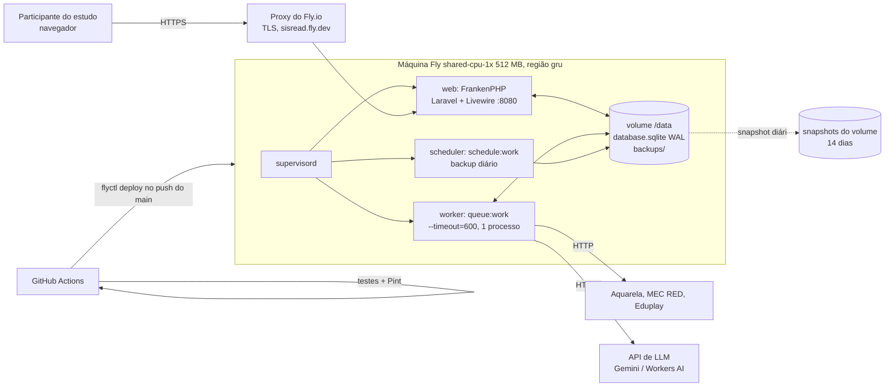

# Deploy (plano proposto)

Plano para colocar o SisREAd no ar **de graça ou quase**: projeto acadêmico (UFJF/UTFPR), pouco
tráfego, usado em estudos com usuários. Os preços foram pesquisados em **2026-10-06** e mudam com
frequência (a Hetzner e a Oracle mudaram as condições em junho de 2026). Confira as fontes no fim
antes de decidir.

> Nada aqui foi criado ainda: nenhuma conta, nenhum segredo, nenhum deploy. Os arquivos
> (`Dockerfile`, `fly.toml`, `docker-compose.prod.yml`, `.github/workflows/ci.yml`) são uma
> **proposta** pronta para uso, mas quem cria as contas e configura os segredos é a equipe.

## Resumo da recomendação

| | Principal | Alternativa |
|---|---|---|
| App + worker + agendador | **Fly.io**, 1 máquina `shared-cpu-1x` 512 MB em `gru` (São Paulo), um container com supervisord | **VPS com Docker Compose**: Oracle Cloud Always Free (US$ 0) ou Hetzner CX23 |
| Banco | **SQLite** num volume do Fly (1 GB), modo WAL | SQLite no disco da VPS |
| LLM | **Gemini 3.1 Flash-Lite** (chave paga com teto de gastos; tier grátis no desenvolvimento) | **Cloudflare Workers AI** (Llama 3.1 8B, cota grátis diária) |
| CI/CD | GitHub Actions: testes + Pint em todo PR; deploy do `main` com `flyctl` | Mesmo CI; deploy por `git pull && docker compose up -d --build` |
| HTTPS | Automático (`*.fly.dev` ou domínio próprio) | Automático (Caddy/FrankenPHP + Let's Encrypt) |
| **Custo mensal** | **≈ US$ 6–7** (≈ US$ 4 se usar a região `iad`), mais ≈ US$ 1–3 de LLM | **US$ 0** (Oracle) ou **≈ € 5,49–6,60** (Hetzner, com backup), mais a LLM |

Por que essa combinação: o app precisa de **um processo que nunca dorme** (o worker de fila) e hoje
usa **SQLite para tudo** (dados, sessão, cache e fila). Uma máquina só, com o banco num volume
local, roda o código atual **sem mudanças de banco** e evita a condição de corrida do item 3 de
[problemas-conhecidos.md](problemas-conhecidos.md), que aparece com dois workers. O Fly cobra pouco
por isso e dá HTTPS, logs, snapshots e deploy pelo CI sem administrar servidor.

## Arquitetura



O que roda no container (ver [`docker/supervisord.conf`](../docker/supervisord.conf)):

- **web**: FrankenPHP (Caddy + PHP) servindo `public/`. No Fly ouve HTTP na porta 8080 e o proxy
  do Fly faz o HTTPS; na VPS ouve 80/443 e emite o certificado sozinho.
- **worker**: `queue:work --timeout=600 --tries=3`, **um processo só**, reiniciado pelo supervisord
  se cair e reciclado a cada hora (`--max-time=3600`).
- **scheduler**: `schedule:work`. Com `QUEUE_WORKER_SUPERVISIONADO=true` (padrão da imagem), o
  agendamento de `queue:work` de [`routes/console.php`](../routes/console.php) é desligado para
  não criar um segundo worker. Sobra o backup diário do SQLite.
- **entrypoint** ([`docker/entrypoint.sh`](../docker/entrypoint.sh)): cria o banco vazio se faltar,
  liga o WAL, roda `migrate --force` e `db:seed --force` (o seeder é idempotente), gera os caches
  de config/rotas/views e sobe o supervisord.

As migrations rodam no boot, e não num `release_command` do Fly, porque o `release_command` roda
numa máquina temporária **sem o volume**, onde o SQLite não existe.

## 1. Hospedagem do app

Requisitos do SisREAd: PHP 8.2+, **worker contínuo** (sem ele as buscas nunca terminam), jobs de até
600 s, disco persistente se ficar no SQLite, e algum agendador.

| Opção | Custo real/mês | Dorme? | Worker contínuo | Disco persistente | Observações |
|---|---|---|---|---|---|
| **Fly.io** | 512 MB: US$ 3,69 na região base; **≈ US$ 5,96 em `gru`** (multiplicador 1,615). Volume US$ 0,15/GB. IPv4 compartilhado e certificados grátis | Só se configurado (`auto_stop`); aqui fica **ligado** | Sim, no mesmo container (supervisord) ou num process group | Sim (volume de **uma** máquina) | Sem free tier para contas novas (trial de 2 h de máquina ou 7 dias). Snapshots: 10 GB grátis/mês |
| Render | Web Starter US$ 7 + Background Worker US$ 7 + disco | Free dorme após 15 min | Só pago (não há worker grátis) | Disco preso a **um** serviço: web e worker não compartilham o SQLite → exige Postgres | ≈ US$ 20+/mês para o nosso caso |
| Railway | Hobby US$ 5 com US$ 5 de uso incluído; RAM US$ 10/GB, CPU US$ 20/vCPU, volume US$ 0,15/GB | Não | Sim | Sim (volume de um serviço; o mesmo Dockerfile serve) | Provável US$ 5–8/mês; bom plano B gerenciado |
| Koyeb | Free: 512 MB, 0,1 vCPU, dorme após 1 h; Pro US$ 29 + uso | Free sim | **Free não aceita worker** | Free sem volume | Fora para o nosso caso |
| Laravel Cloud | Starter US$ 5 com US$ 5 de crédito (1º mês grátis); Flex 512 MB até US$ 6/mês ligado direto | Hiberna (scale-to-zero) | 1 *managed queue* no Starter; *worker clusters* só no Growth (US$ 20) | Sem disco local: exige Postgres serverless ou MySQL | Integração Laravel ótima, mas força a sair do SQLite e os limites da fila gerenciada (job de 600 s?) precisam ser confirmados |
| **Oracle Cloud Always Free** | **US$ 0**: Ampere A1 com 2 OCPU e 12 GB no total (era 4/24 até 15/06/2026), 200 GB de disco | Não | Sim (VPS) | Sim | Instância ociosa (CPU, rede **e** memória < 20% no p95 por 7 dias) pode ser **recuperada**; falta de capacidade no cadastro é comum; você administra o servidor |
| **Hetzner CX23** | **€ 5,49** (2 vCPU, 4 GB, 40 GB, 20 TB; preço desde 15/06/2026); backup +20% | Não | Sim (VPS) | Sim | Barato e estável, mas sem região no Brasil (latência ≈ 200 ms) e você administra o servidor |

**Conclusão:** Fly.io é o melhor equilíbrio entre custo, latência (tem região em São Paulo, perto
dos participantes e das APIs do MEC RED/Eduplay/Aquarela) e trabalho de operação. Se custo zero for
obrigatório, a mesma imagem roda numa VM Oracle Always Free com `docker-compose.prod.yml`.

> Região: `gru` custa ≈ 60% a mais que a base. Trocar `primary_region` para `iad` no `fly.toml`
> derruba a máquina para ≈ US$ 3,69, com ≈ 120 ms a mais de latência por requisição. O
> `wire:poll` de 2 s faz várias requisições por busca, então `gru` vale a diferença num estudo.

## 2. Banco hospedado

O código usa só o Schema Builder (nenhum SQL específico de SQLite nas migrations nem em `app/`;
conferido com `grep` por `DB::statement`, `PRAGMA`, `*Raw` e `LIKE`), então trocar de banco é
possível. A questão é se compensa.

| Opção | Custo | Mudanças no código | Fila (`QUEUE_CONNECTION=database`) | Problemas 2, 3 e 6 |
|---|---|---|---|---|
| **SQLite em volume** (recomendado) | Já incluso no volume (≈ US$ 0,15/mês) | **Nenhuma** | Funciona bem com **um** worker | Não piora nem melhora. Com um worker, o 3 praticamente não ocorre |
| Turso / libSQL | Free: 100 bancos, 5 GB, 500 M linhas lidas/mês | Driver novo (`tursodatabase/turso-driver-laravel`) + extensão libSQL no PHP | Cada consulta vira ida e volta pela rede; a fila em banco faz polling a cada 3 s | Nenhum ganho |
| Postgres no Neon | Free: 0,5 GB e 100 CU-horas/mês, suspende após 5 min ocioso | Só `DB_CONNECTION=pgsql` + migração dos dados (`pgloader`) | **O polling do worker mantém o compute acordado 24 h**: ≈ 180 CU-h/mês a 0,25 CU, acima do free | Permite `lockForUpdate()` real, que resolveria o 3 |
| Postgres no Supabase | Free: 500 MB; pausa após 7 dias com pouca atividade | Igual ao Neon | Funciona (o polling do worker provavelmente evita a pausa) | Igual ao Neon |
| MySQL (Laravel Cloud, outros) | Pago na maioria | Igual ao Postgres | Funciona | Igual ao Postgres |

Sobre os problemas de concorrência:

- **Item 3 (merge de `Data.data` sem lock)**: é uma corrida de *ler, mexer, gravar* no PHP. Nenhum
  banco resolve isso sozinho; o Postgres só torna a correção fácil (`lockForUpdate` dentro de uma
  transação). No SQLite a correção mais simples é cada job gravar o seu pedaço em linha ou coluna
  própria, sem merge. Enquanto não corrigir, **mantenha `numprocs=1`** no supervisord.
- **Item 2 (`finished` prematuro)** e **item 6 (`searched_at` como chave)**: são lógica do app e
  independem do banco. A correção do 6 é passar o `id` de `Data` para os jobs.
- **"database is locked"**: o WAL (ligado no entrypoint) deixa o web ler enquanto o worker grava, e
  o PDO do SQLite já espera até 60 s por um lock. Com o tráfego de um estudo, isso basta.

**Recomendação:** manter SQLite agora. Migrar para Postgres só se o app precisar de mais de uma
máquina ou de vários workers, e aí junto com a correção do item 3.

## 3. LLM (classificação de meta por REA)

Hoje: Ollama local, `gemma3:4b`, só no Aquarela, timeout de 10 s por chamada. A sessão
`feat/llm-todos-repositorios` vai levar a classificação para os três repositórios, com cache por REA
e provedor substituível.

### Premissas da estimativa

- Prompt atual (`ProcessAquarela::classificarMetaComLLM`) ≈ **700 tokens de entrada** (instruções +
  título, descrição e tipo do REA) e ≈ **15 de saída** (`{"meta": "..."}`).
- Uma busca com meta retorna **≈ 200 REAs** somando os repositórios (houve uma busca real com 157 só
  do Aquarela). Sem cache: 200 chamadas ≈ 140 mil tokens de entrada e 3 mil de saída.
- Com cache por REA, o custo tende ao número de **REAs distintos**: os interesses são poucos (4
  fixos + os dos colaboradores), então o catálogo deve ficar em alguns milhares. Usamos 5.000.
- Estudo típico: **300 buscas/mês**. O pior caso (sem cache) multiplica 300 × 200 chamadas.

| Provedor / modelo | Preço (1 M tokens, entrada/saída) | Busca sem cache | Mês com cache (5.000 REAs, uma vez) | Mês sem cache (300 buscas) | Limites | Privacidade |
|---|---|---|---|---|---|---|
| Ollama numa VM própria (`gemma3:4b`, CPU) | US$ 0 além da VM | — | — | — | Em 2 vCPUs ARM/x86 cada chamada leva **dezenas de segundos**: estoura o timeout de 10 s e o job de 600 s com 200 REAs | Total (nada sai da VM) |
| Groq, `llama-3.1-8b-instant` (free) | US$ 0 | US$ 0 | US$ 0 | Inviável | 30 RPM, **6.000 TPM**, 14.400 RPD, 500 mil TPD: ≈ 8 chamadas/min → 25 min por busca sem cache | Metadados públicos de REA |
| Groq, `llama-3.1-8b-instant` (pago) | 0,05 / 0,08 | **≈ US$ 0,007** | ≈ US$ 0,18 | ≈ US$ 2,20 | Limites maiores no plano Developer | Idem |
| Gemini 3.1 Flash-Lite (free) | US$ 0 | US$ 0 | US$ 0 (≈ 5 buscas sem cache/dia) | Inviável | ≈ 30 RPM e 1.000 RPD (variam por conta; ver AI Studio) | **No free, o Google pode usar o conteúdo para melhorar produtos** |
| **Gemini 3.1 Flash-Lite (pago)** | 0,25 / 1,50 | **≈ US$ 0,04** | **≈ US$ 1** | ≈ US$ 12 | Limites do tier pago; teto de gastos configurável | No pago, os dados não são usados para treino |
| OpenRouter, modelos `:free` | US$ 0 | US$ 0 | US$ 0 | Inviável | 20 RPM e **50 req/dia** (1.000/dia após comprar US$ 10 de crédito) | Depende do provedor por trás de cada modelo |
| Cloudflare Workers AI, `llama-3.1-8b-instruct-fp8-fast` | 10 mil *neurons*/dia grátis; depois US$ 0,011 por mil (exige Workers Paid, US$ 5/mês) | ≈ 680 neurons ≈ **US$ 0,0075** (≈ 14 buscas sem cache/dia no grátis) | US$ 0 (cabe na cota diária ao longo de alguns dias) | ≈ US$ 2 + US$ 5 do plano | 300 RPM | Metadados públicos de REA |
| Claude Haiku 4.5 (`claude-haiku-4-5`) | 1,00 / 5,00 | **≈ US$ 0,155** | ≈ US$ 3,90 | ≈ US$ 46 | Limites por tier de uso | Sem uso para treino por padrão na API |

Latência (estimativa, a medir): APIs hospedadas respondem em ≈ 0,2–1 s por chamada pequena (Groq é a
mais rápida). Em série, 200 chamadas levam de 1 a 4 min. Por isso a sessão da LLM deveria **paralelizar
as chamadas** (`Http::pool`, por exemplo de 5 a 10 por vez), respeitando o RPM do provedor. A
classificação precisa caber nos 600 s do job.

Privacidade: o prompt leva **só metadados públicos do REA** (título, descrição, tipo), nada do
participante. Mesmo assim, para um estudo com seres humanos, convém citar no protocolo/TCLE que um
serviço externo classifica os recursos, e preferir um tier pago que não use os dados para treino.

**Recomendação:**

1. **Principal: Gemini 3.1 Flash-Lite com chave paga** e teto de gastos baixo (ex.: US$ 5). Com
   cache, custa ≈ US$ 1–3/mês; sem cache, ≈ US$ 0,04 por busca. No desenvolvimento, usar a chave
   free (sabendo que os dados podem ser usados pelo Google).
2. **Alternativa grátis: Cloudflare Workers AI** (Llama 3.1 8B fp8-fast), que dá ≈ 14 buscas sem cache
   por dia e 300 RPM. Com cache aquecido, a cota diária sobra.
3. Se a qualidade dos modelos pequenos não bastar (o item 18 de
   [problemas-conhecidos.md](problemas-conhecidos.md) mostra viés no `gemma3:4b`), **Claude Haiku 4.5**
   custa ≈ US$ 4 para classificar um catálogo de 5.000 REAs uma vez.
4. Antes de escolher, rotular à mão ≈ 50 REAs e medir a concordância de cada modelo. É barato e
   dá um número para a monografia.

Sugestão de interface para a sessão da LLM (a alinhar com `feat/llm-todos-repositorios`): Groq,
Gemini, OpenRouter, Cloudflare e o próprio Ollama expõem o formato **OpenAI Chat Completions**.
Um driver com `LLM_BASE_URL`, `LLM_API_KEY`, `LLM_MODEL`, `LLM_TIMEOUT` e `LLM_CONCORRENCIA` cobre
todos eles trocando só variáveis de ambiente. A chave entra como segredo (`fly secrets set`), nunca
no `fly.toml`.

## 4. Pipeline

### CI ([`.github/workflows/ci.yml`](../.github/workflows/ci.yml))

- Roda em todo PR e em todo push no `main`: PHP 8.3, `composer install`, `.env` a partir do
  `.env.example`, `key:generate` e `php artisan test` (o `phpunit.xml` usa SQLite em memória e fila
  `sync`, então não precisa de banco nem de worker). No Linux o `pcntl`/`posix` existem, então
  não precisa do `--ignore-platform-req`.
- **Pint só nos arquivos PHP alterados no PR.** Em 2026-10-06, 24 arquivos antigos não passam no
  Pint; checar o repositório inteiro bloquearia todo PR. Depois que alguém rodar `vendor/bin/pint`
  no projeto todo (num PR só de formatação, para não conflitar com as outras frentes), troque o
  passo por `vendor/bin/pint --test`.
- **Deploy** só no push do `main`, depois dos testes, e **desligado por padrão**: só roda quando a
  variável de repositório `FLY_DEPLOY` for `true`. Usa o ambiente `producao` do GitHub (dá para
  exigir aprovação manual lá) e `concurrency` para nunca rodar dois deploys juntos.

### Segredos

| Segredo | Onde | Como |
|---|---|---|
| `APP_KEY` | Fly (`fly secrets set`) | `php artisan key:generate --show` uma vez. **Não troque depois**: invalida sessões e dados criptografados |
| Chave da LLM | Fly | `fly secrets set LLM_API_KEY=...` (nome final depende da sessão da LLM) |
| `FLY_API_TOKEN` | GitHub → Settings → Secrets → Actions | `fly tokens create deploy -x 999999h` (token restrito a este app) |
| `FLY_DEPLOY=true` | GitHub → Settings → Variables → Actions | Liga o job de deploy |

O repositório é **público**: nada de `.env`, banco ou backup em commits, issues, logs do CI ou
artefatos do Actions. O [`.dockerignore`](../.dockerignore) tira `database/*.sqlite`, `.env*` e
`storage/credentials.json` do contexto de build, então o banco local nunca é enviado ao builder do Fly.

### Migrations

Rodam a cada boot no entrypoint (`migrate --force`). Migration destrutiva exige backup antes (ver
abaixo). Um deploy reinicia a máquina: o Fly espera até `kill_timeout = 300` s e o supervisord
espera o worker terminar, mas um job com mais de 300 s é cortado. Como `retry_after` da fila é
gigantesco (`config/queue.php`), o job cortado **não é refeito** e a busca fica incompleta. Por
isso, **não faça deploy durante sessões do estudo**.

### Backups

Três camadas, porque o banco tem dados pessoais (e-mails e hashes de senha) e dados da pesquisa:

1. **Snapshots diários do volume** pelo Fly, retidos por 14 dias (`snapshot_retention` no
   `fly.toml`; os primeiros 10 GB/mês são grátis, e o banco tem ≈ 50 MB). Restaurar:
   `fly volumes snapshots list <volume>` e `fly volumes create sisread_data --snapshot-id <id>`.
2. **Cópia diária consistente** às 06:00 UTC ([`docker/backup-sqlite.sh`](../docker/backup-sqlite.sh),
   agendada em `routes/console.php`): `sqlite3 .backup` (seguro com o banco em uso), gzip, últimas
   7 em `/data/backups`. Protege contra erro humano e migration ruim, mas fica no mesmo volume.
3. **Cópia fora do Fly**, manual, ao menos mensal e **antes de toda migration destrutiva**:
   `fly ssh sftp get /data/backups/<arquivo>.sqlite.gz`, guardada em armazenamento institucional
   (Drive da UFJF/UTFPR, com acesso restrito). Nunca em GitHub, nem como artefato do Actions.

### Logs

`LOG_CHANNEL=stderr`: tudo (web, worker, agendador) sai em `fly logs` e no painel do Fly. A
retenção é curta. O que importa para a pesquisa já fica no banco (`search_metrics`,
`explanation_events`, `failed_jobs`). O health check `/up` do `fly.toml` mostra no painel se o web
parou de responder (e tira a máquina do roteamento); processos que caem são reiniciados pelo
supervisord. O Fly não lê o `HEALTHCHECK` do Dockerfile, que só vale para Docker puro.

### HTTPS e domínio

`https://<app>.fly.dev` funciona de saída, com certificado automático. Para um domínio
institucional (ex.: `sisread.ufjf.br`): `fly certs add sisread.ufjf.br`, pedir à TI um `CNAME` para
`<app>.fly.dev` e atualizar `APP_URL`. O `bootstrap/app.php` confia no proxy (`trustProxies`) para
o Laravel e o Livewire gerarem URLs `https://`.

## 5. Passo a passo (Fly.io)

Pré-requisitos: conta no Fly.io com cartão (não há free tier) e o
[`flyctl`](https://fly.io/docs/flyctl/install/) instalado.

1. **Criar o app sem deploy**, reaproveitando os arquivos do repositório (troque o nome se
   `sisread` estiver ocupado e ajuste `app` e `APP_URL` no `fly.toml`):
   ```bash
   fly launch --copy-config --no-deploy --name sisread --region gru
   ```
   Se o `flyctl` oferecer gerar Dockerfile ou bancos (Postgres/Redis), **recuse**.
2. **Criar o volume** do SQLite na mesma região:
   ```bash
   fly volumes create sisread_data --region gru --size 1
   ```
3. **Gravar os segredos** (a `APP_KEY` vem do seu ambiente local):
   ```bash
   fly secrets set APP_KEY="$(php artisan key:generate --show)"
   ```
   Depois, a chave da LLM, com o nome definido pela sessão `feat/llm-todos-repositorios`.
4. **Primeiro deploy** (manual, para acompanhar):
   ```bash
   fly deploy
   ```
   O entrypoint cria um banco vazio, aplica as migrations e o seeder. Confira com
   `fly logs` e abra `https://sisread.fly.dev`. Faça uma busca de ponta a ponta: se ela terminar,
   o worker está rodando.
5. **(Opcional) Importar os dados antigos.** Antes, decidam se o estudo deve começar com banco
   vazio: o banco antigo tem e-mails e hashes de senha (LGPD). Se for importar, faça antes de
   abrir o estudo, sem ninguém usando:
   ```bash
   fly ssh sftp shell
   # dentro do sftp: put database.sqlite /data/database.sqlite.novo
   fly ssh console -C "sh -c 'mv /data/database.sqlite.novo /data/database.sqlite && rm -f /data/database.sqlite-wal /data/database.sqlite-shm'"
   fly machine restart
   ```
   O boot seguinte aplica as migrations que faltarem.
6. **Ligar o deploy automático**: criar o token (`fly tokens create deploy -x 999999h`), gravar
   como segredo `FLY_API_TOKEN` no GitHub, criar o ambiente `producao` (com aprovação manual, se
   quiserem) e a variável `FLY_DEPLOY=true`. A partir daí, cada merge no `main` com testes verdes
   publica sozinho.
7. **Rotina**: baixar um backup por mês (`fly ssh sftp get`), revisar `failed_jobs` e não fazer
   deploy durante sessões do estudo.

## 6. Passo a passo da alternativa (VPS com Docker Compose)

Serve para Oracle Cloud Always Free (US$ 0) ou Hetzner CX23 (€ 5,49 + backup).

1. Criar a VM (Oracle: shape `VM.Standard.A1.Flex`, 2 OCPU/12 GB, Ubuntu; Hetzner: CX23, Ubuntu).
   Abrir as portas 22, 80 e 443 (na Oracle, também na *security list* da VCN).
2. Instalar Docker e o plugin compose, clonar o repositório e criar o `.env.production` (fora do
   git) com `APP_KEY`, `APP_URL=https://<domínio>` e a chave da LLM.
3. Apontar o DNS do domínio para o IP da VM e subir:
   ```bash
   DOMINIO=sisread.exemplo.br docker compose -f docker-compose.prod.yml up -d --build
   ```
4. Atualizar: `git pull && DOMINIO=... docker compose -f docker-compose.prod.yml up -d --build`.
   Dá para automatizar com um job de SSH no Actions, mas aí a chave SSH vira segredo do GitHub.
5. Backups: o mesmo script grava em `/data/backups` dentro do volume `sisread-data`. Copiar para
   fora com `docker compose cp` + `scp`, e ligar o backup da Hetzner (+20%) ou os
   *boot volume backups* da Oracle (5 grátis).
6. Cuidados: atualizações de segurança do SO (`unattended-upgrades`), firewall, e, na Oracle, o
   risco de recuperação de instância ociosa (há relatos de que converter a conta para
   *Pay As You Go*, mantendo-se nos limites grátis, evita isso; confirmar antes).

## Mudanças no código feitas com este plano

- [`bootstrap/app.php`](../bootstrap/app.php): `trustProxies(at: '*')`, para o HTTPS atrás do proxy.
- [`config/queue.php`](../config/queue.php) + [`routes/console.php`](../routes/console.php): a chave
  `queue.worker_supervisionado` (`QUEUE_WORKER_SUPERVISIONADO`) desliga o agendamento de `queue:work`
  quando o worker já roda sob o supervisord. O agendamento que sobra ganhou `withoutOverlapping()`:
  antes, com cron, ele subia um worker novo a cada minuto. Também foi agendado o backup diário do
  SQLite (só roda se existir `/data/database.sqlite`, ou seja, no container).
- Localmente nada muda: `scripts/start.ps1` continua subindo `serve` + `queue:work`.

## Validação feita

- `php artisan test` passa (116 testes) com as mudanças.
- `vendor/bin/pint --test` passa nos arquivos PHP alterados.
- `migrate --force` + `db:seed --force` num SQLite novo e vazio, `config:cache`, `route:cache`,
  `view:cache` e `schedule:list` (com e sem `QUEUE_WORKER_SUPERVISIONADO`) rodam sem erro.
- **O build da imagem Docker não foi testado**: o Docker não está instalado nesta máquina. Rode
  `docker build -t sisread .` (ou o primeiro `fly deploy`, que builda no Fly) antes de confiar nela.

## Fontes (consultadas em 2026-10-06)

- Fly.io, preços: https://docs.fly.io/about/pricing
- Render, free e workers: https://render.com/pricing ·
  https://livemy.app/blog/render-pricing
- Railway, planos: https://docs.railway.com/reference/pricing/plans
- Koyeb: https://www.koyeb.com/pricing · https://www.koyeb.com/docs/faq/pricing
- Laravel Cloud: https://laravel.com/cloud/pricing
- Oracle Always Free (limites e recuperação de ociosas): https://docs.oracle.com/en-us/iaas/Content/FreeTier/resourceref.htm ·
  https://infoq.com/news/2026/07/oracle-cloud-free-tier-limits/
- Hetzner (reajuste de 15/06/2026): https://www.hetzner.com/cloud/ ·
  https://northflank.com/blog/hetzner-cloud-server-price-increases
- Neon: https://neon.com/pricing · https://www.jetadmin.io/blog/neon-pricing/
- Supabase, pausa de projetos: https://supabase.com/docs/guides/platform/free-project-pausing
- Turso: https://turso.tech/pricing · https://turso.tech/blog/announcing-laravel-support
- Groq, limites e preços: https://console.groq.com/docs/rate-limits ·
  https://eesel.ai/blog/groq-pricing · https://usagepricing.com/ai-token-pricing/groq/llama-3-1-8b-groq
- Gemini API, preços e uso de dados: https://ai.google.dev/gemini-api/docs/pricing ·
  limites do free: https://tinkerllm.com/blog/gemini-api-free-tier-limits-rate-quotas/
- OpenRouter, limites dos modelos free: https://openrouter.ai/docs/api-reference/limits
- Cloudflare Workers AI: https://developers.cloudflare.com/workers-ai/platform/pricing/ ·
  https://developers.cloudflare.com/workers-ai/platform/limits/
- Claude Haiku 4.5, preço: https://platform.claude.com/docs/en/about-claude/pricing

Os números de limites do Groq (free), Gemini (free) e Render vêm de fontes secundárias, porque as
páginas oficiais não mostravam a tabela sem login. Confira no painel de cada provedor.
