# Fluxos de transparência

> Como a transparência funciona de ponta a ponta, da resposta ao EMAPRE até o texto que aparece
> na tela e o registro de uso. A especificação dos campos e dos textos está em
> [transparencia.md](transparencia.md); este documento mostra **o caminho que os dados percorrem**.
> Estado do código: branch `feat/escrutabilidade` (fase 1, fase 1b e escrutabilidade).

Os diagramas usam [Mermaid](https://mermaid.js.org/) e são renderizados pelo GitHub e pelo VS Code
(com a extensão *Markdown Preview Mermaid Support*).

## Sumário

1. [Visão geral](#1-visão-geral)
2. [Fluxo 1: entradas do usuário](#2-fluxo-1-entradas-do-usuário)
3. [Fluxo 2: início da busca e contexto](#3-fluxo-2-início-da-busca-e-contexto)
4. [Fluxo 3: classificação nos jobs](#4-fluxo-3-classificação-nos-jobs)
5. [Fluxo 4: persistência](#5-fluxo-4-persistência)
6. [Fluxo 5: exibição e ordenação](#6-fluxo-5-exibição-e-ordenação)
7. [Fluxo 6: explicação de um REA](#7-fluxo-6-explicação-de-um-rea)
8. [Fluxo 7: REAs que não aparecem](#8-fluxo-7-reas-que-não-aparecem)
9. [Fluxo 8: registro de uso](#9-fluxo-8-registro-de-uso)
10. [Fluxo 9: escrutabilidade](#10-fluxo-9-escrutabilidade)
11. [Cenários de ponta a ponta](#11-cenários-de-ponta-a-ponta)
12. [Onde cada pergunta é respondida](#12-onde-cada-pergunta-é-respondida)
13. [Limites atuais](#13-limites-atuais)

---

## 1. Visão geral

O SisREAd recomenda por **regras**. A transparência é *model-intrinsic*: cada regra, ao ser
avaliada, devolve um **critério** (`status`, `valor`, `esperado`, `fonte`, `evidencia`), e o rótulo
da recomendação é calculado a partir desses mesmos critérios. A explicação não é gerada depois, por
outro mecanismo: ela é o registro da decisão.

O usuário recebe três níveis de explicação:

| Nível | Pergunta | Elemento na tela | Gerado por |
|---|---|---|---|
| Item | "Por que este REA está aqui?" | selo de faixa + **Por que este REA?** | `ExplanationRenderer::faixa/resumo/linhas/avisos` |
| Lista | "Como esta lista foi ordenada?" | painel **Como ordenamos estes resultados** | `Ranking::contar`, `FindREA::statusRepositorios`, `FindREA::ocultos` |
| Usuário | "O que o sistema usou sobre mim?" | painel **O que usamos sobre você** | `FindREA::$contexto` |

### Componentes e fluxo geral

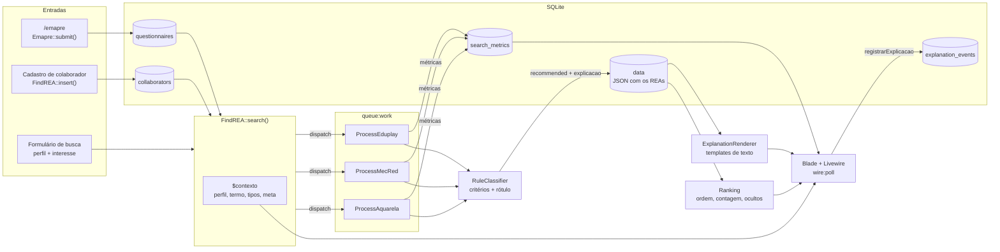
```mermaid
flowchart LR
    subgraph Entradas
        EM["/emapre<br/>Emapre::submit()"]
        CO["Cadastro de colaborador<br/>FindREA::insert()"]
        BU["Formulário de busca<br/>perfil + interesse"]
    end

    subgraph Banco["SQLite"]
        Q[("questionnaires")]
        C[("collaborators")]
        D[("data<br/>JSON com os REAs")]
        SM[("search_metrics")]
        EE[("explanation_events")]
    end

    subgraph Busca["FindREA::search()"]
        CTX["$contexto<br/>perfil, termo, tipos, meta"]
    end

    subgraph Fila["queue:work"]
        JA["ProcessAquarela"]
        JM["ProcessMecRed"]
        JE["ProcessEduplay"]
    end

    RC["RuleClassifier<br/>critérios + rótulo"]
    RK["Ranking<br/>ordem, contagem, ocultos"]
    ER["ExplanationRenderer<br/>templates de texto"]
    UI["Blade + Livewire<br/>wire:poll"]

    EM --> Q
    CO --> C
    BU --> Busca
    Q --> Busca
    C --> Busca
    Busca -->|dispatch| JA & JM & JE
    JA & JM & JE --> RC
    RC -->|recommended + explicacao| D
    JA & JM & JE -->|métricas| SM
    D --> RK --> UI
    SM --> UI
    CTX --> UI
    D --> ER --> UI
    UI -->|registrarExplicacao| EE
```

A decisão acontece **uma vez**, no job, e fica gravada. A tela só lê: o `Ranking` ordena pelo rótulo
gravado e o `ExplanationRenderer` transforma a estrutura gravada em texto. Nada é recalculado na
exibição, por isso a explicação não pode divergir da posição do item.

---

## 2. Fluxo 1: entradas do usuário

Antes de qualquer busca, duas fontes alimentam a personalização. Ambas aparecem depois no painel
**O que usamos sobre você**.

### 2.1 Meta de aprendizagem (EMAPRE)

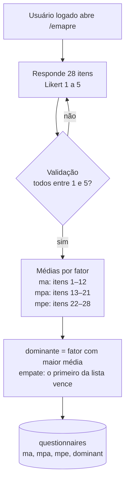
```mermaid
flowchart TD
    A["Usuário logado abre /emapre"] --> B["Responde 28 itens<br/>Likert 1 a 5"]
    B --> C{"Validação<br/>todos entre 1 e 5?"}
    C -- não --> B
    C -- sim --> D["Médias por fator<br/>ma: itens 1–12<br/>mpa: itens 13–21<br/>mpe: itens 22–28"]
    D --> E["dominante = fator com maior média<br/>empate: o primeiro da lista vence"]
    E --> F[("questionnaires<br/>ma, mpa, mpe, dominant")]
```

O que vai para a transparência: a meta dominante **e as três médias**, para o usuário ver que a
meta não é um rótulo arbitrário. O empate resolvido em silêncio é o problema conhecido #19.

### 2.2 Tipos preferidos (colaboradores)

Colaboradores cadastram REAs com interesse, perfil e **item** (tipo de conteúdo). Na busca, esses
itens viram os *tipos preferidos*, em duas origens:

| Origem | Regra | Campo do contexto |
|---|---|---|
| Mesma busca | colaboradores com o **mesmo interesse e perfil** | `tipos_busca` |
| Geral | todos os outros tipos cadastrados | `tipos_gerais` |

Os dois grupos são normalizados por `RuleClassifier::normalizarTipos` (minúsculas, sem acento, sem
vazios ou duplicados, `e-book` também vira `livro digital`). Os jobs recebem a união, mas o painel
mostra as duas origens separadas, porque a origem geral é bem mais fraca (problema #11).

---

## 3. Fluxo 2: início da busca e contexto

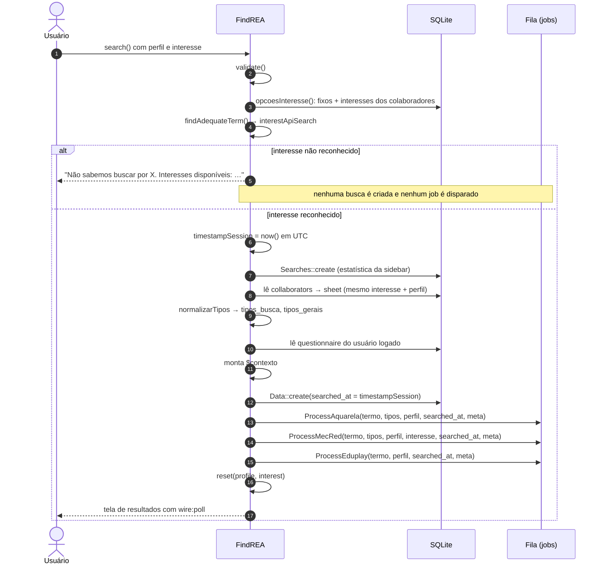
```mermaid
sequenceDiagram
    autonumber
    actor U as Usuário
    participant F as FindREA
    participant DB as SQLite
    participant Q as Fila (jobs)

    U->>F: search() com perfil e interesse
    F->>F: validate()
    F->>DB: opcoesInteresse(): fixos + interesses dos colaboradores
    F->>F: findAdequateTerm() → interestApiSearch

    alt interesse não reconhecido
        F-->>U: "Não sabemos buscar por X. Interesses disponíveis: …"
        Note over F,Q: nenhuma busca é criada e nenhum job é disparado
    else interesse reconhecido
        F->>F: timestampSession = now() em UTC
        F->>DB: Searches::create (estatística da sidebar)
        F->>DB: lê collaborators → sheet (mesmo interesse + perfil)
        F->>F: normalizarTipos → tipos_busca, tipos_gerais
        F->>DB: lê questionnaire do usuário logado
        F->>F: monta $contexto
        F->>DB: Data::create(searched_at = timestampSession)
        F->>Q: ProcessAquarela(termo, tipos, perfil, searched_at, meta)
        F->>Q: ProcessMecRed(termo, tipos, perfil, interesse, searched_at, meta)
        F->>Q: ProcessEduplay(termo, perfil, searched_at, meta)
        F->>F: reset(profile, interest)
        F-->>U: tela de resultados com wire:poll
    end
```

Pontos que importam para a transparência:

- **O aviso de interesse não reconhecido vem antes de criar a busca.** Antes da fase 1b a busca
  saía com termo vazio e a tela ficava em branco (problema #14).
- **`$contexto` é montado antes do `reset`** dos campos, senão perfil e interesse se perderiam.
- **`searched_at` é a chave** que liga `data`, `search_metrics` e `explanation_events` à mesma busca.
- O `$contexto` fica no estado do componente Livewire. Ele descreve a **última** busca da sessão e
  não é gravado no banco.

Exemplo de `$contexto`:

```php
[
    'perfil'       => 'Ensino fundamental',
    'interesse'    => 'Algoritmos',
    'termo_api'    => 'algoritmos',
    'tipos_busca'  => ['video'],
    'tipos_gerais' => ['jogo', 'e-book', 'livro digital'],
    'meta'         => ['dominante' => 'ma', 'ma' => 4.2, 'mpa' => 3.1, 'mpe' => 2.0], // ou null
]
```

---

## 4. Fluxo 3: classificação nos jobs

Cada job consulta um repositório e, **para cada REA**, monta os critérios, calcula o rótulo e grava
os dois juntos. Os três jobs seguem o mesmo esqueleto e diferem no quanto conseguem verificar.

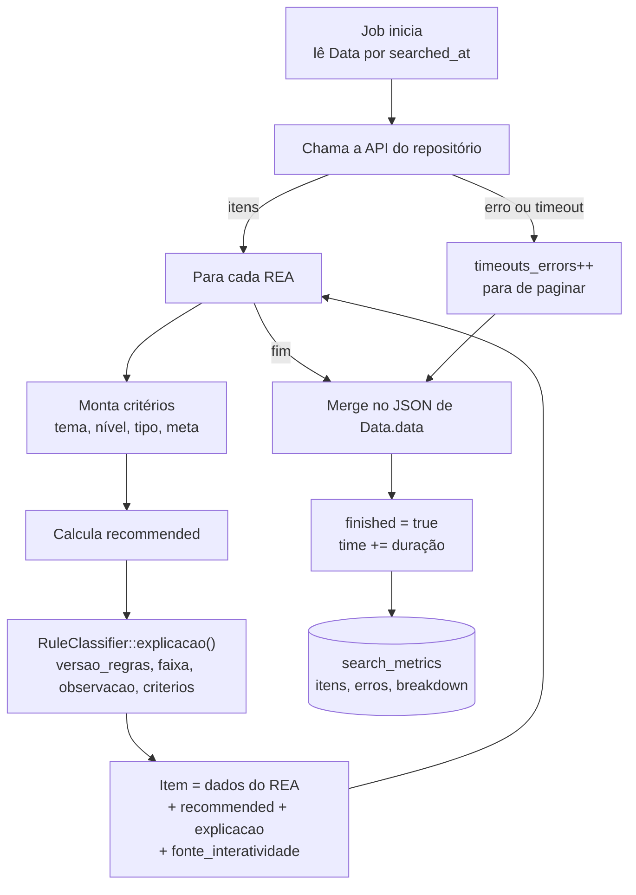
```mermaid
flowchart TD
    S["Job inicia<br/>lê Data por searched_at"] --> API["Chama a API do repositório"]
    API -->|erro ou timeout| ERR["timeouts_errors++<br/>para de paginar"]
    API -->|itens| LOOP["Para cada REA"]
    LOOP --> CR["Monta critérios<br/>tema, nível, tipo, meta"]
    CR --> RT["Calcula recommended"]
    RT --> EX["RuleClassifier::explicacao()<br/>versao_regras, faixa, observacao, criterios"]
    EX --> IT["Item = dados do REA<br/>+ recommended + explicacao<br/>+ fonte_interatividade"]
    IT --> LOOP
    LOOP -->|fim| MG["Merge no JSON de Data.data"]
    ERR --> MG
    MG --> FN["finished = true<br/>time += duração"]
    FN --> MT[("search_metrics<br/>itens, erros, breakdown")]
```

### 4.1 Aquarela: regra completa

É o único repositório em que todos os critérios são de fato avaliados.

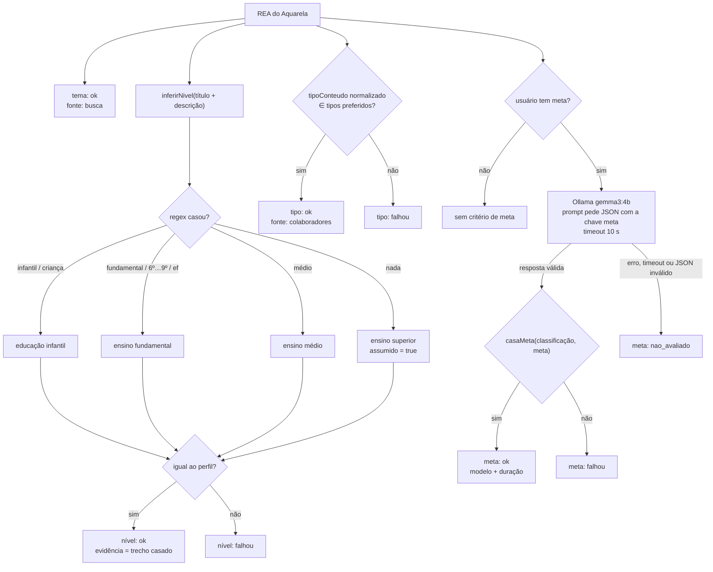
```mermaid
flowchart TD
    R["REA do Aquarela"] --> T["tema: ok<br/>fonte: busca"]
    R --> N["inferirNivel(título + descrição)"]
    N --> N1{"regex casou?"}
    N1 -- "infantil / criança" --> NV1["educação infantil"]
    N1 -- "fundamental / 6º…9º / ef" --> NV2["ensino fundamental"]
    N1 -- "médio" --> NV3["ensino médio"]
    N1 -- nada --> NV4["ensino superior<br/>assumido = true"]
    NV1 & NV2 & NV3 & NV4 --> NC{"igual ao perfil?"}
    NC -- sim --> NOK["nível: ok<br/>evidência = trecho casado"]
    NC -- não --> NF["nível: falhou"]

    R --> TP{"tipoConteudo normalizado<br/>∈ tipos preferidos?"}
    TP -- sim --> TOK["tipo: ok<br/>fonte: colaboradores"]
    TP -- não --> TF["tipo: falhou"]

    R --> M{"usuário tem meta?"}
    M -- não --> MSEM["sem critério de meta"]
    M -- sim --> LLM["Ollama gemma3:4b<br/>prompt pede JSON com a chave meta<br/>timeout 10 s"]
    LLM -->|resposta válida| CM{"casaMeta(classificação, meta)"}
    CM -- sim --> MOK["meta: ok<br/>modelo + duração"]
    CM -- não --> MF["meta: falhou"]
    LLM -->|erro, timeout ou JSON inválido| MNA["meta: nao_avaliado"]
```

O critério de nível guarda **o trecho que casou** (por exemplo, `6º`). Quando nada casa, o sistema
assume ensino superior e marca `assumido = true`, e o texto diz isso em vez de apresentar o palpite
como fato. O critério de meta guarda o modelo e o tempo da chamada.

### 4.2 Do critério ao rótulo (`RuleClassifier::rotular`)

Um critério "atende" quando o status é `ok` ou `filtro_api`. `nao_avaliado` **nunca** conta como
atendido.

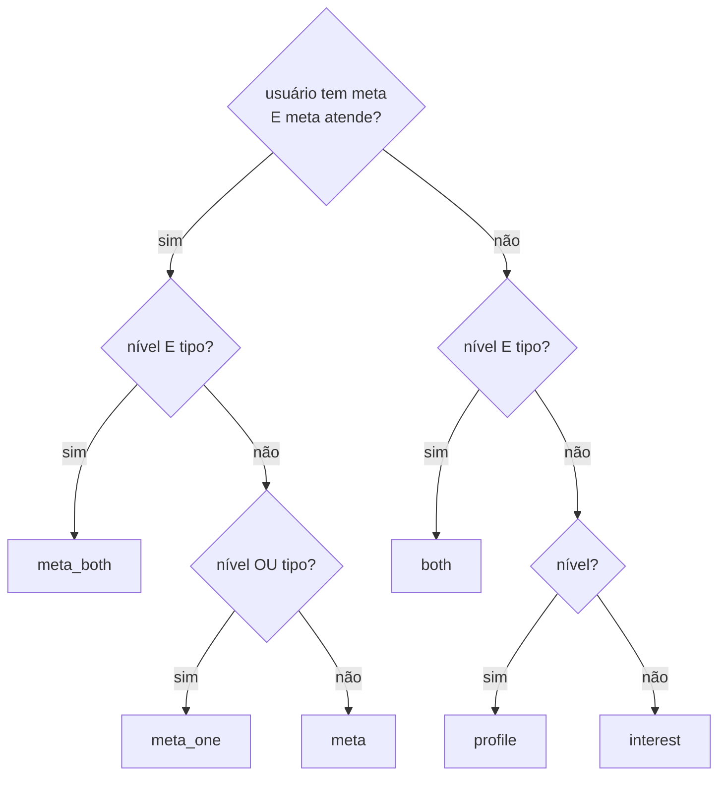
```mermaid
flowchart TD
    A{"usuário tem meta<br/>E meta atende?"}
    A -- sim --> B{"nível E tipo?"}
    B -- sim --> MB["meta_both"]
    B -- não --> C{"nível OU tipo?"}
    C -- sim --> MO["meta_one"]
    C -- não --> MM["meta"]
    A -- não --> D{"nível E tipo?"}
    D -- sim --> BO["both"]
    D -- não --> E{"nível?"}
    E -- sim --> PR["profile"]
    E -- não --> IN["interest"]
```

Repare que, com meta, um REA cuja meta **falhou** ou **não foi avaliada** cai no ramo da direita e
recebe `both`, `profile` ou `interest`. Esses rótulos não são exibidos para quem tem meta (ver
[Fluxo 5](#6-fluxo-5-exibição-e-ordenação)); é assim que um REA incompatível com a meta sai da lista.

### 4.3 MEC RED e Eduplay: faixa fixa por política

Nesses repositórios a API não devolve o que seria preciso para conferir nível, tipo ou meta. O rótulo
é fixo por política e a explicação **declara que é política** (campo `observacao`).

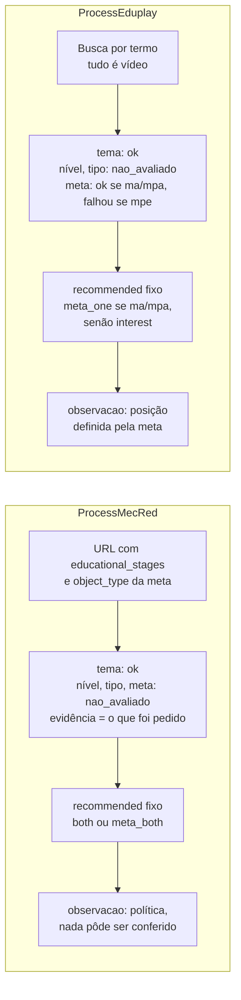
```mermaid
flowchart LR
    subgraph MEC["ProcessMecRed"]
        M1["URL com educational_stages<br/>e object_type da meta"] --> M2["tema: ok<br/>nível, tipo, meta: nao_avaliado<br/>evidência = o que foi pedido"]
        M2 --> M3["recommended fixo<br/>both ou meta_both"]
        M3 --> M4["observacao: política,<br/>nada pôde ser conferido"]
    end
    subgraph EDU["ProcessEduplay"]
        E1["Busca por termo<br/>tudo é vídeo"] --> E2["tema: ok<br/>nível, tipo: nao_avaliado<br/>meta: ok se ma/mpa, falhou se mpe"]
        E2 --> E3["recommended fixo<br/>meta_one se ma/mpa,<br/>senão interest"]
        E3 --> E4["observacao: posição<br/>definida pela meta"]
    end
```

| | Aquarela | MEC RED | Eduplay |
|---|---|---|---|
| tema | ✓ busca | ✓ busca | ✓ busca |
| nível | ✓/✗ regex | ? pedido na URL, não conferido | ? repositório não informa |
| tipo | ✓/✗ colaboradores | ? repositório não informa | ? sempre vídeo |
| meta | ✓/✗/? IA | ? pedido na URL, não conferido | ✓/✗ padrão do repositório |
| rótulo | calculado | fixo | fixo |
| `observacao` | — | sim | sim |
| `fonte_interatividade` | `dtype` ou `indisponivel` | `meta_usuario` ou `indisponivel` | `padrao_repositorio` |

`fonte_interatividade` diz de onde vêm as colunas de interatividade da tabela. No MEC RED, por
exemplo, elas são derivadas **da meta do usuário**, não do recurso, e o *tooltip* da coluna diz isso.

---

## 5. Fluxo 4: persistência

Tudo da busca vai para uma linha de `data`. A explicação fica dentro do JSON, sem coluna própria.

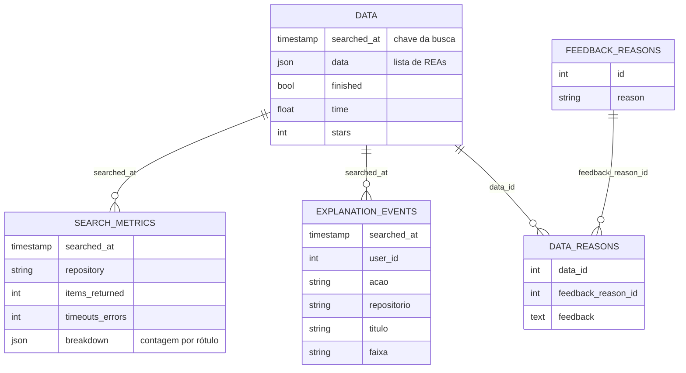
```mermaid
erDiagram
    DATA ||--o{ SEARCH_METRICS : "searched_at"
    DATA ||--o{ EXPLANATION_EVENTS : "searched_at"
    DATA ||--o{ DATA_REASONS : "data_id"
    FEEDBACK_REASONS ||--o{ DATA_REASONS : "feedback_reason_id"

    DATA {
        timestamp searched_at "chave da busca"
        json data "lista de REAs"
        bool finished
        float time
        int stars
    }
    SEARCH_METRICS {
        timestamp searched_at
        string repository
        int items_returned
        int timeouts_errors
        json breakdown "contagem por rótulo"
    }
    EXPLANATION_EVENTS {
        timestamp searched_at
        int user_id
        string acao
        string repositorio
        string titulo
        string faixa
    }
    DATA_REASONS {
        int data_id
        int feedback_reason_id
        text feedback
    }
    FEEDBACK_REASONS {
        int id
        string reason
    }
```

Estrutura de um item em `data.data`:

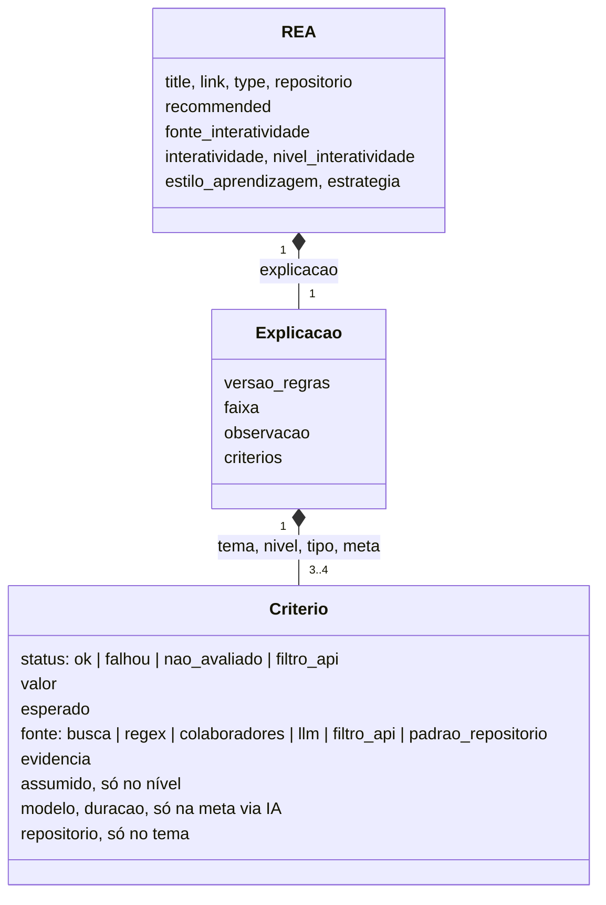
```mermaid
classDiagram
    class REA {
        title, link, type, repositorio
        recommended
        fonte_interatividade
        interatividade, nivel_interatividade
        estilo_aprendizagem, estrategia
    }
    class Explicacao {
        versao_regras
        faixa
        observacao
        criterios
    }
    class Criterio {
        status: ok | falhou | nao_avaliado | filtro_api
        valor
        esperado
        fonte: busca | regex | colaboradores | llm | filtro_api | padrao_repositorio
        evidencia
        assumido, só no nível
        modelo, duracao, só na meta via IA
        repositorio, só no tema
    }
    REA "1" *-- "1" Explicacao : explicacao
    Explicacao "1" *-- "3..4" Criterio : tema, nivel, tipo, meta
```

`search_metrics` também alimenta a transparência: é dele que a tela tira quantos repositórios
já responderam e se algum falhou.

---

## 6. Fluxo 5: exibição e ordenação

A tela de resultados é um `wire:poll.keep-alive`: o Livewire re-renderiza o componente a cada
2,5 s (padrão do Livewire 3). Em cada ciclo, a view relê a linha de `data` e recalcula a
ordenação, os painéis e o progresso.

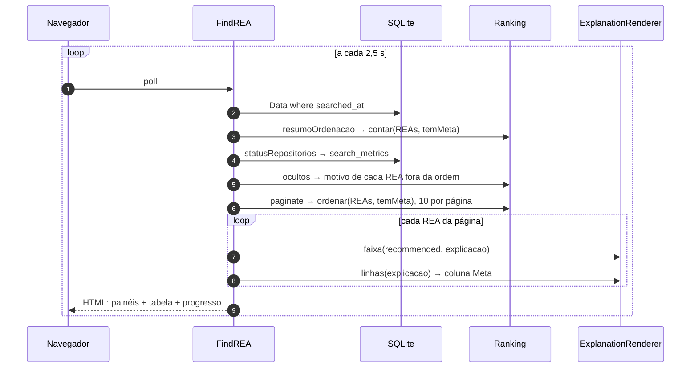
```mermaid
sequenceDiagram
    autonumber
    participant B as Navegador
    participant F as FindREA
    participant DB as SQLite
    participant RK as Ranking
    participant ER as ExplanationRenderer

    loop a cada 2,5 s
        B->>F: poll
        F->>DB: Data where searched_at
        F->>RK: resumoOrdenacao → contar(REAs, temMeta)
        F->>DB: statusRepositorios → search_metrics
        F->>RK: ocultos → motivo de cada REA fora da ordem
        F->>RK: paginate → ordenar(REAs, temMeta), 10 por página
        loop cada REA da página
            F->>ER: faixa(recommended, explicacao)
            F->>ER: linhas(explicacao) → coluna Meta
        end
        F-->>B: HTML: painéis + tabela + progresso
    end
```

### 6.1 Ordem das faixas (`Ranking`)

`temMeta()` é verdadeiro quando o usuário logado tem `questionnaire.dominant`.

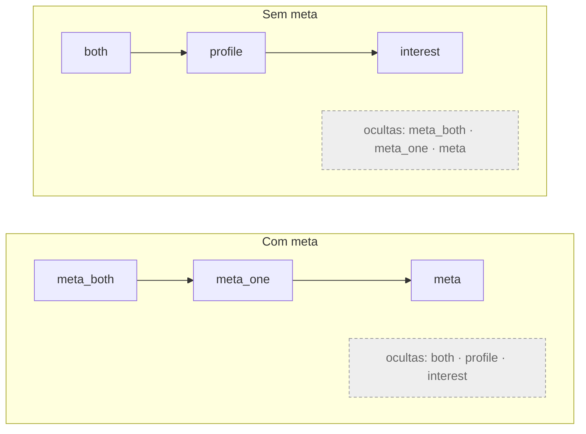
```mermaid
flowchart LR
    subgraph COM["Com meta"]
        direction LR
        a1["meta_both"] --> a2["meta_one"] --> a3["meta"]
        a4["ocultas: both · profile · interest"]:::oculto
    end
    subgraph SEM["Sem meta"]
        direction LR
        b1["both"] --> b2["profile"] --> b3["interest"]
        b4["ocultas: meta_both · meta_one · meta"]:::oculto
    end
    classDef oculto fill:#eee,stroke:#999,stroke-dasharray: 4 3,color:#666
```

Em cinza, as faixas ocultas naquele contexto. Dentro de cada faixa a ordem é a de chegada dos
repositórios (ordenação estável). Como os jobs terminam em tempos diferentes, essa ordem varia de
uma busca para outra, e o painel avisa isso.

### 6.2 Progresso da busca

`statusRepositorios()` lê uma linha de `search_metrics` por repositório:

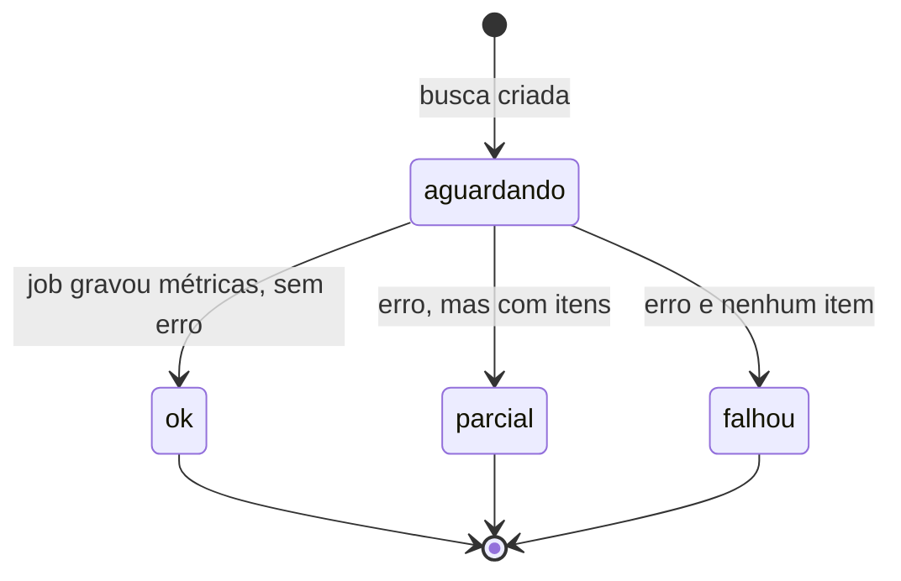
```mermaid
stateDiagram-v2
    [*] --> aguardando: busca criada
    aguardando --> ok: job gravou métricas, sem erro
    aguardando --> parcial: erro, mas com itens
    aguardando --> falhou: erro e nenhum item
    ok --> [*]
    parcial --> [*]
    falhou --> [*]
```

Enquanto algum repositório está `aguardando`, a tela mostra "Consultando repositórios… N de 3
responderam. A lista continua crescendo até o último responder." Isso existe porque `finished` vira
`true` quando o **primeiro** job termina (problema #2): sem o contador, a lista parecia pronta e
continuava mudando.

No painel **Como ordenamos**, a lista "Repositórios consultados" mostra o mesmo estado por
repositório. Uma lista sem nenhum item do Aquarela aparece como "não respondeu", e não como
ausência inexplicada.

### 6.3 O que cada painel mostra

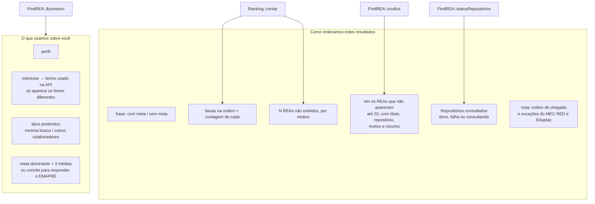
```mermaid
flowchart TD
    subgraph P1["Como ordenamos estes resultados"]
        p1a["frase: com meta / sem meta"]
        p1b["faixas na ordem + contagem de cada"]
        p1c["N REAs não exibidos, por motivo"]
        p1d["Ver os REAs que não aparecem<br/>até 20, com título, repositório,<br/>motivo e resumo"]
        p1e["Repositórios consultados<br/>itens, falha ou consultando"]
        p1f["nota: ordem de chegada<br/>e exceções do MEC RED e Eduplay"]
    end
    subgraph P2["O que usamos sobre você"]
        p2a["perfil"]
        p2b["interesse → termo usado na API<br/>só aparece se forem diferentes"]
        p2c["tipos preferidos<br/>mesma busca / outros colaboradores"]
        p2d["meta dominante + 3 médias<br/>ou convite para responder o EMAPRE"]
    end
    R1["Ranking::contar"] --> p1b & p1c
    R2["FindREA::ocultos"] --> p1d
    R3["FindREA::statusRepositorios"] --> p1e
    R4["FindREA::$contexto"] --> P2
```

---

## 7. Fluxo 6: explicação de um REA

Cada linha da tabela tem um selo de faixa e o botão **Por que este REA?**. O botão só alterna a
visibilidade (Alpine, `x-show`); o conteúdo já veio renderizado no servidor.

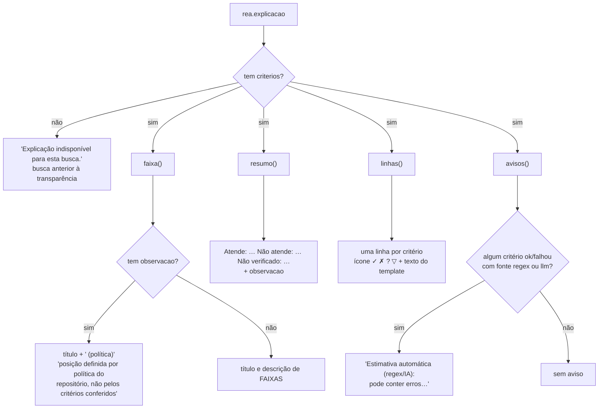
```mermaid
flowchart TD
    E["rea.explicacao"] --> V{"tem criterios?"}
    V -- não --> L["'Explicação indisponível para esta busca.'<br/>busca anterior à transparência"]
    V -- sim --> F["faixa()"]
    V -- sim --> R["resumo()"]
    V -- sim --> LI["linhas()"]
    V -- sim --> AV["avisos()"]

    F --> F1{"tem observacao?"}
    F1 -- sim --> F2["título + ' (política)'<br/>'posição definida por política do<br/>repositório, não pelos critérios conferidos'"]
    F1 -- não --> F3["título e descrição de FAIXAS"]

    R --> R1["Atende: … Não atende: … Não verificado: …<br/>+ observacao"]
    LI --> LI1["uma linha por critério<br/>ícone ✓ ✗ ? ▽ + texto do template"]
    AV --> AV1{"algum critério ok/falhou<br/>com fonte regex ou llm?"}
    AV1 -- sim --> AV2["'Estimativa automática (regex/IA):<br/>pode conter erros…'"]
    AV1 -- não --> AV3["sem aviso"]
```

O mesmo `linhas()` alimenta a coluna **Meta** da tabela: ela mostra o ícone e
"Compatível / Incompatível / Não verificado", com o texto completo no *tooltip*.

### 7.1 Como o texto do nível é escolhido

O template do nível é o mais ramificado, porque é onde o sistema mais estima:

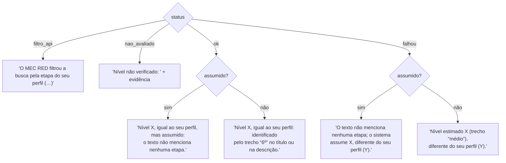
```mermaid
flowchart TD
    S{"status"} -- filtro_api --> A["'O MEC RED filtrou a busca pela etapa do seu perfil (…)'"]
    S -- nao_avaliado --> B["'Nível não verificado: ' + evidência"]
    S -- ok --> C{"assumido?"}
    C -- sim --> C1["'Nível X, igual ao seu perfil, mas assumido:<br/>o texto não menciona nenhuma etapa.'"]
    C -- não --> C2["'Nível X, igual ao seu perfil: identificado<br/>pelo trecho “6º” no título ou na descrição.'"]
    S -- falhou --> D{"assumido?"}
    D -- sim --> D1["'O texto não menciona nenhuma etapa; o sistema<br/>assume X, diferente do seu perfil (Y).'"]
    D -- não --> D2["'Nível estimado X (trecho “médio”),<br/>diferente do seu perfil (Y).'"]
```

Regra que vale para todos os templates: **nada com status `nao_avaliado` recebe ✓**. O texto diz o
que impediu a verificação, usando a `evidencia` gravada pelo job.

---

## 8. Fluxo 7: REAs que não aparecem

Um REA não aparece quando o rótulo dele não está na ordem do contexto atual. `Ranking::motivo`
explica por quê:

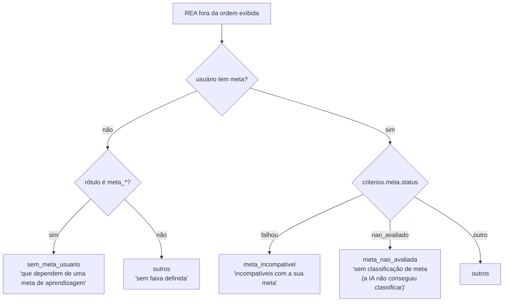
```mermaid
flowchart TD
    A["REA fora da ordem exibida"] --> B{"usuário tem meta?"}
    B -- não --> C{"rótulo é meta_*?"}
    C -- sim --> C1["sem_meta_usuario<br/>'que dependem de uma meta de aprendizagem'"]
    C -- não --> C2["outros<br/>'sem faixa definida'"]
    B -- sim --> D{"criterios.meta.status"}
    D -- falhou --> D1["meta_incompativel<br/>'incompatíveis com a sua meta'"]
    D -- nao_avaliado --> D2["meta_nao_avaliada<br/>'sem classificação de meta<br/>(a IA não conseguiu classificar)'"]
    D -- outro --> D3["outros"]
```

O painel mostra a contagem por motivo e, ao expandir **Ver os REAs que não aparecem**, até 20 itens
com o resumo dos critérios. Assim o usuário vê o que foi descartado e por qual regra.

O motivo `meta_nao_avaliada` separa duas situações que, sem ele, seriam iguais na tela: "este REA
não serve para a sua meta" e "a IA não respondeu". Com o Ollama fora do ar, todos os REAs do
Aquarela caem no segundo caso (problema #16), e o painel diz isso.

---

## 9. Fluxo 8: registro de uso

Abrir uma explicação gera um evento. Os eventos são a base da avaliação com usuários (Etapa 3).

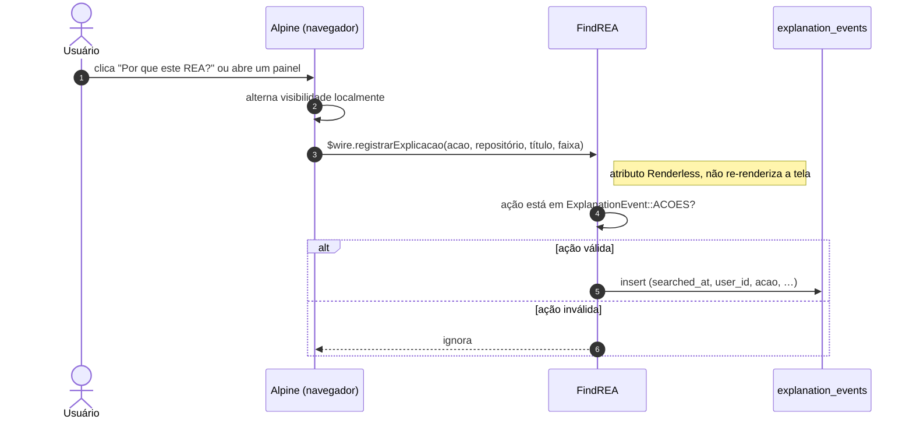
```mermaid
sequenceDiagram
    autonumber
    actor U as Usuário
    participant A as Alpine (navegador)
    participant F as FindREA
    participant DB as explanation_events

    U->>A: clica "Por que este REA?" ou abre um painel
    A->>A: alterna visibilidade localmente
    A->>F: $wire.registrarExplicacao(acao, repositório, título, faixa)
    Note right of F: atributo Renderless, não re-renderiza a tela
    F->>F: ação está em ExplanationEvent::ACOES?
    alt ação válida
        F->>DB: insert (searched_at, user_id, acao, …)
    else ação inválida
        F-->>A: ignora
    end
```

| Gatilho na tela | `acao` | Campos extras |
|---|---|---|
| **Por que este REA?** (ao abrir) | `abriu_explicacao` | repositório, título, faixa |
| painel **Como ordenamos** | `abriu_ordenacao` | — |
| painel **O que usamos sobre você** | `abriu_contexto` | — |
| **Ver os REAs que não aparecem** | `abriu_ocultos` | — |
| **Corrigir** (nível, meta) ou **Editar tipos preferidos** | `abriu_correcao` | repositório, título, faixa (vazios no painel de tipos) |

Os painéis usam `<details>` com `wire:ignore.self`, para que o *poll* não feche o painel que o
usuário abriu. O evento é disparado no `toggle`, só quando o painel abre.

O feedback da busca também ganhou dois motivos ligados às explicações (migration
`2026_09_18_000001` e `FeedbackReasonSeeder`):

- "As explicações das recomendações estavam erradas ou confusas."
- "As explicações não ajudaram a entender a ordem dos resultados."

---

## 10. Fluxo 9: escrutabilidade

O usuário corrige o que o sistema **estimou**, e a lista se reordena na hora. É o único fluxo em
que `data.data` é escrito fora dos jobs. Decisões e alternativas estão em
[plano-escrutabilidade.md](plano-escrutabilidade.md).

### 10.1 O que é corrigível

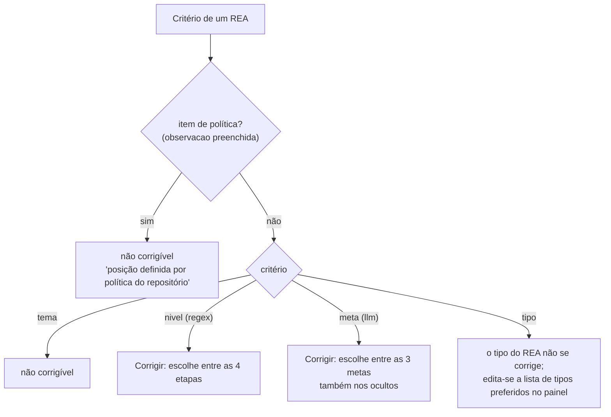
```mermaid
flowchart TD
    C["Critério de um REA"] --> P{"item de política?<br/>(observacao preenchida)"}
    P -- sim --> N0["não corrigível<br/>'posição definida por política do repositório'"]
    P -- não --> T{"critério"}
    T -- tema --> N1["não corrigível"]
    T -- "nivel (regex)" --> S1["Corrigir: escolhe entre as 4 etapas"]
    T -- "meta (llm)" --> S2["Corrigir: escolhe entre as 3 metas<br/>também nos ocultos"]
    T -- tipo --> S3["o tipo do REA não se corrige;<br/>edita-se a lista de tipos preferidos no painel"]
```

### 10.2 Corrigir nível ou meta

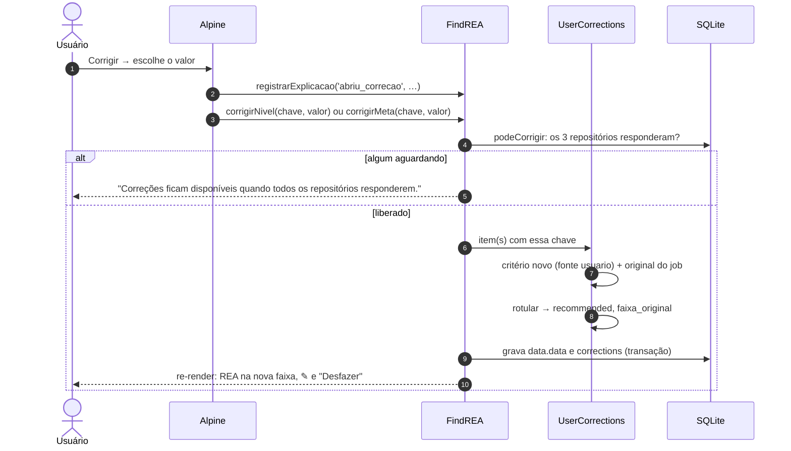
```mermaid
sequenceDiagram
    autonumber
    actor U as Usuário
    participant A as Alpine
    participant F as FindREA
    participant UC as UserCorrections
    participant DB as SQLite

    U->>A: Corrigir → escolhe o valor
    A->>F: registrarExplicacao('abriu_correcao', …)
    A->>F: corrigirNivel(chave, valor) ou corrigirMeta(chave, valor)
    F->>DB: podeCorrigir: os 3 repositórios responderam?
    alt algum aguardando
        F-->>U: "Correções ficam disponíveis quando todos os repositórios responderem."
    else liberado
        F->>UC: item(s) com essa chave
        UC->>UC: critério novo (fonte usuario) + original do job
        UC->>UC: rotular → recommended, faixa_original
        F->>DB: grava data.data e corrections (transação)
        F-->>U: re-render: REA na nova faixa, ✎ e "Desfazer"
    end
```

O usuário informa **o que o REA é**. O status sai da mesma comparação do job (nível igual ao perfil,
`casaMeta` com a meta do usuário), e o rótulo de `RuleClassifier::rotular`. Por isso a explicação
continua sendo o registro da decisão.

### 10.3 Ciclo de vida de um critério

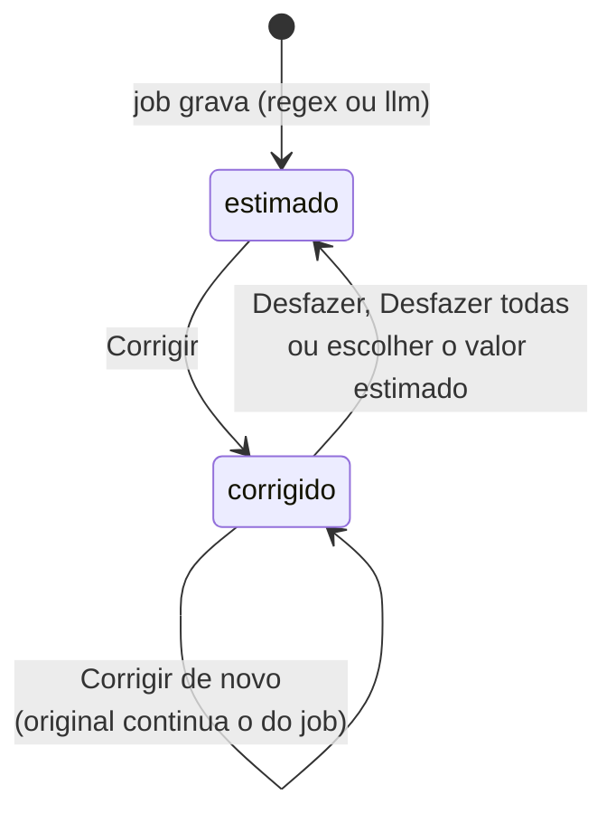
```mermaid
stateDiagram-v2
    [*] --> estimado: job grava (regex ou llm)
    estimado --> corrigido: Corrigir
    corrigido --> corrigido: Corrigir de novo<br/>(original continua o do job)
    corrigido --> estimado: Desfazer, Desfazer todas<br/>ou escolher o valor estimado
```

### 10.4 Editar os tipos preferidos

```mermaid
flowchart LR
    A["Painel 'O que usamos sobre você'<br/>Editar tipos preferidos"] --> B["checklist: tipos do sistema<br/>∪ tipos dos REAs da busca<br/>com origem e nº de REAs"]
    B --> C["redefinirTipos(lista)"]
    C --> D["todo REA com tipo de fonte colaboradores:<br/>esperado = lista nova<br/>esperado_original guardado"]
    D --> E["rotular → nova faixa"]
    E --> F[("data.data + corrections<br/>itens_afetados = REAs que mudaram de faixa")]
    F --> G["painel: 'Definidos por você nesta busca'<br/>+ Voltar aos tipos do sistema"]
```

Os itens do MEC RED e do Eduplay não mudam: o tipo deles não é comparado com os preferidos.

### 10.5 Como a correção aparece

| Lugar | O que muda |
|---|---|
| Selo e posição | faixa recalculada; a linha mantém a explicação aberta (`wire:key` pela `chave`) |
| **Por que este REA?** | "Faixa alterada pela sua correção: antes X, agora Y", ✎ na linha do critério, "informado por você (o sistema tinha estimado …)", botões Corrigir de novo e Desfazer |
| Aviso de estimativa | some para o critério corrigido |
| **Como ordenamos** | "N REAs mudaram de faixa por correções suas" + Desfazer todas |
| **Ver os REAs que não aparecem** | Corrigir a meta; motivo "incompatíveis com a sua meta (corrigido por você)" |
| **O que usamos sobre você** | tipos definidos por você e os que o sistema tinha usado |

### 10.6 Registro

```mermaid
erDiagram
    DATA ||--o{ CORRECTIONS : "searched_at"
    CORRECTIONS {
        timestamp searched_at
        int user_id "null para visitante"
        string acao "corrigir | desfazer"
        string alvo "nivel | meta | tipos | todas"
        string chave_rea "null para tipos e todas"
        json valor_anterior
        json valor_novo
        string faixa_anterior
        string faixa_nova
        int itens_afetados "REAs que mudaram de faixa"
    }
```

---

## 11. Cenários de ponta a ponta

### 11.1 Visitante sem login, perfil *Ensino fundamental*, interesse *Algoritmos*

```mermaid
flowchart LR
    A["search()"] --> B["contexto.meta = null"]
    B --> C["Aquarela: 'Algoritmos para o 6º ano', tipo vídeo"]
    C --> D["nível ok (trecho '6º')<br/>tipo ok (vídeo ∈ preferidos)"]
    D --> E["both"]
    E --> F["1ª faixa: Nível e tipo"]
    F --> G["Atende: tema, nível, tipo.<br/>+ aviso de estimativa (regex)"]
```

No mesmo cenário, um item do MEC RED também fica em `both`, mas com o selo **Nível e tipo
(política)** e o resumo "Atende: tema. Não verificado: nível, tipo." seguido da observação de
política. Um vídeo do Eduplay fica em `interest` (**Só tema (política)**).

### 11.2 Usuário com meta *Aprendizagem* e Ollama no ar

```mermaid
flowchart LR
    A["search()"] --> B["contexto.meta = ma + médias"]
    B --> C["Aquarela: cada REA vai ao LLM"]
    C --> D{"LLM: Aprendizagem?"}
    D -- sim --> E["meta ok → meta_both / meta_one / meta"]
    D -- não --> F["meta falhou → both / profile / interest"]
    E --> G["aparece na lista"]
    F --> H["oculto: incompatível com a sua meta"]
```

Eduplay entra em `meta_one` (vídeos considerados adequados a `ma`/`mpa`); MEC RED em `meta_both`
por política.

### 11.3 Usuário com meta e Ollama fora do ar

```mermaid
flowchart LR
    A["Aquarela: chamada ao LLM falha"] --> B["meta: nao_avaliado"]
    B --> C["rotular: meta não atende → ramo sem meta"]
    C --> D["rótulo both / profile / interest"]
    D --> E["oculto, motivo meta_nao_avaliada"]
    E --> F["painel: 'N sem classificação de meta<br/>(a IA não conseguiu classificar)'"]
```

A lista mostra só MEC RED e Eduplay, e o painel explica a ausência do Aquarela pelo motivo certo.
Com a escrutabilidade, o usuário pode abrir **Ver os REAs que não aparecem** e informar a meta de um
REA do Aquarela. Se ela casar com a dele, o REA volta para a lista ([Fluxo 9](#10-fluxo-9-escrutabilidade)).

---

## 12. Onde cada pergunta é respondida

| Pergunta | Onde é decidida | Onde é gravada | Onde é exibida |
|---|---|---|---|
| Por que este REA está nesta faixa? | `RuleClassifier::rotular` / regra fixa do job | `recommended` + `explicacao` em `data.data` | selo + `explicacao-rea.blade.php` |
| Como o nível foi descoberto? | `RuleClassifier::inferirNivel` | `criterios.nivel.evidencia`, `assumido` | `ExplanationRenderer::textoNivel` |
| Quem classificou a meta? | `ProcessAquarela::classificarMetaComLLM` | `criterios.meta.modelo`, `duracao` | `textoMeta` + aviso |
| Por que a lista tem esta ordem? | `Ranking::ordem` | — (calculado do rótulo) | painel **Como ordenamos** |
| O que ficou de fora e por quê? | `Ranking::motivo` | — | **Ver os REAs que não aparecem** |
| Algum repositório falhou? | jobs (`timeouts_errors`) | `search_metrics` | progresso + **Repositórios consultados** |
| O que o sistema sabe sobre mim? | `FindREA::findInApi` | `$contexto` (só na sessão) | painel **O que usamos sobre você** |
| De onde vem a interatividade? | cada job | `fonte_interatividade` | *tooltip* das colunas |
| O usuário olhou as explicações? | `FindREA::registrarExplicacao` | `explanation_events` | — (dado de avaliação) |
| O usuário discordou de alguma estimativa? | `FindREA::corrigir*`, `UserCorrections` | `corrections` + `original` no critério | ✎ e "informado por você" na explicação |

---

## 13. Limites atuais

A transparência descreve o que o sistema faz, inclusive quando o sistema faz algo questionável.
Os pontos abaixo são **declarados** na tela, mas não resolvidos:

| Ponto | O que a explicação faz | O que continua igual | Ref. |
|---|---|---|---|
| MEC RED ignora os filtros | marca nível, tipo e meta como não verificados e diz que é política | os itens seguem na faixa mais alta | #15 |
| Viés da IA para "Aprendizagem" | declara modelo, tempo e o viés no aviso | o critério de meta quase não filtra | #18 |
| `finished` prematuro | contador "N de 3 responderam" | a lista cresce enquanto o usuário lê | #2 |
| Tipos de qualquer colaborador contam | painel separa as duas origens | ambas contam igual no critério | #11, #12 |
| Empate no EMAPRE | painel mostra as três médias | o primeiro fator vence em silêncio | #19 |

Outros detalhes observados no código:

- O destaque amarelo da linha usa `auth()->user()` para decidir entre `meta_both` e `both`, e não
  `temMeta()`. Um usuário logado **sem** meta não vê nenhuma linha destacada, porque seus itens
  são `both`, e não `meta_both`.
- Correções valem só para a busca atual. A mesma estimativa errada volta na próxima busca, para o
  mesmo usuário e para os outros. `corrections` permite medir se valeria tornar isso persistente.
- A meta EMAPRE do usuário não é editável na tela (fora do escopo da escrutabilidade).
- `$contexto` não é persistido. Recarregar a página perde o painel **O que usamos sobre você** da
  busca atual, e a avaliação com usuários não tem como reconstruir o que foi mostrado a partir do
  banco.

A próxima fase (contrafactual) usa as mesmas estruturas; ver
[transparencia.md §12](transparencia.md#12-próxima-fase-diferenciais) e
[continuidade-transparencia.md](continuidade-transparencia.md).
