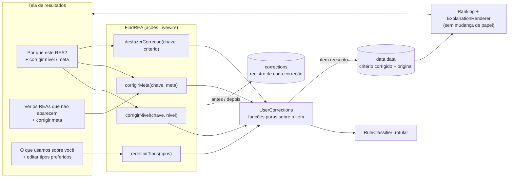
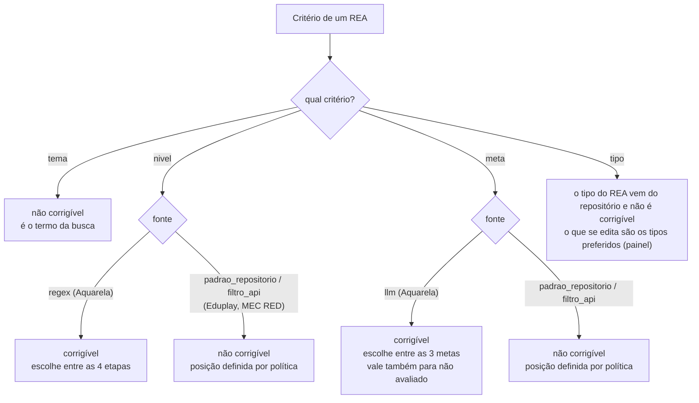
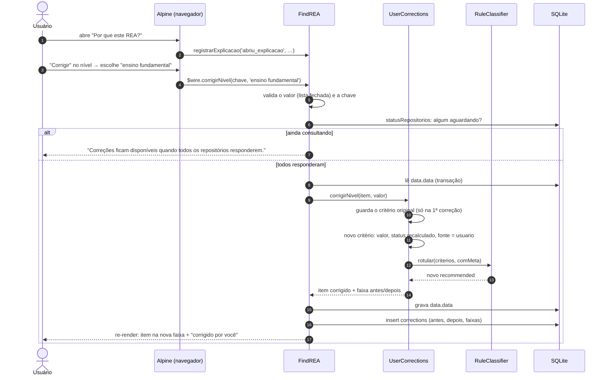
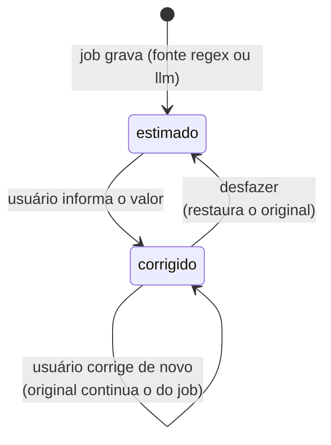
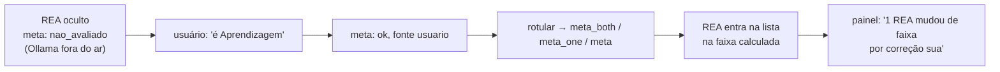
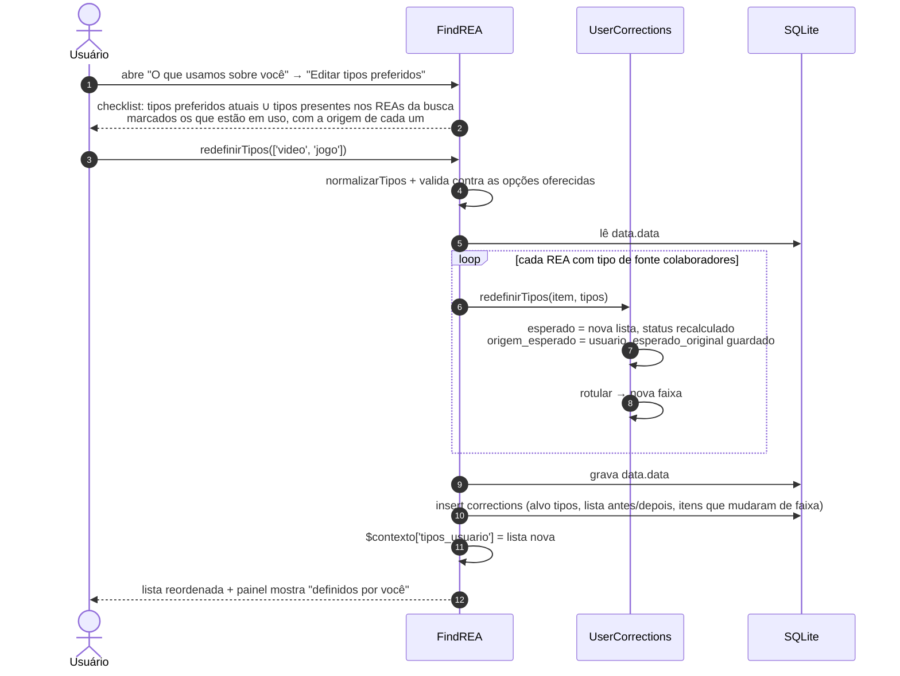
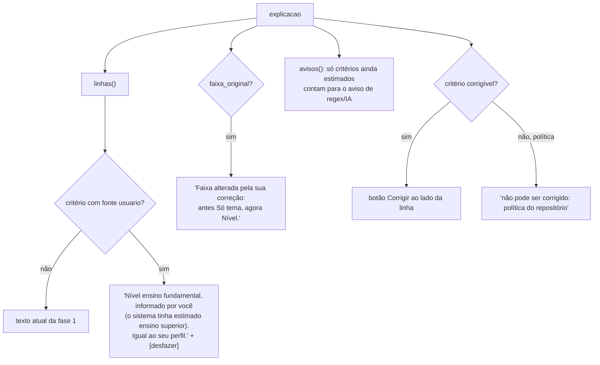
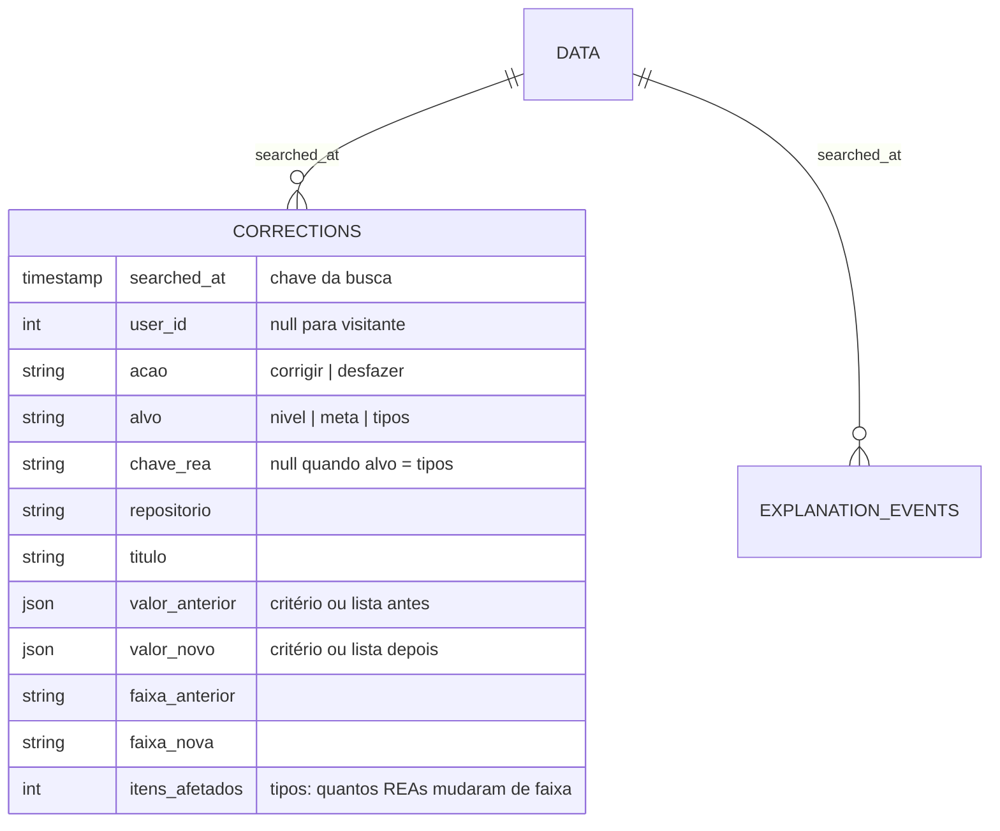

# Plano: escrutabilidade no SisREAd

> Etapa 2 do TCC, parte 2. Continua a transparência ([transparencia.md](transparencia.md),
> [fluxos-transparencia.md](fluxos-transparencia.md)) e reaproveita as mesmas estruturas.
> Estado: **implementado** (passos 1 a 6), branch `feat/escrutabilidade`, PR #4. A especificação
> do que ficou no código está em [transparencia.md §13](transparencia.md#13-escrutabilidade) e o
> fluxo em [fluxos-transparencia.md §10](fluxos-transparencia.md#10-fluxo-9-escrutabilidade).
> Diferenças em relação a este plano estão na §14.

## 1. O que é escrutabilidade aqui

A transparência responde "por que este REA está aqui?". A escrutabilidade dá um passo além: o
usuário **diz ao sistema onde ele errou**, e a recomendação muda na hora. No MSL, só 13% dos artigos
têm isso, e é o diferencial do TCC.

No SisREAd, o sistema faz três suposições que o usuário pode conhecer melhor do que ele:

| Suposição | Como o sistema chega nela | Onde fica gravada | Quem sabe melhor |
|---|---|---|---|
| Nível do REA | regex no título e na descrição (Aquarela) | `criterios.nivel` (fonte `regex`) | o usuário que leu o REA |
| Meta do REA | IA local `gemma3:4b` (Aquarela, com meta) | `criterios.meta` (fonte `llm`) | o usuário que leu o REA |
| Tipos preferidos | tipos cadastrados por colaboradores | `criterios.tipo.esperado` em cada REA | o próprio usuário |

Decisões já tomadas (2026-10-03):

1. **Escopo:** nível do REA, meta do REA e tipos preferidos. A meta EMAPRE do usuário fica fora.
2. **Alcance:** a correção vale **só para a busca atual**. Não afeta outras buscas nem outros usuários.
3. **Efeito:** a correção **reordena a lista na hora** e fica registrada.

Princípios, herdados da transparência:

- **Decisão e explicação continuam vindo da mesma fonte.** A correção sobrescreve o critério, e o
  rótulo é recalculado por `RuleClassifier::rotular` a partir dele. A tela só lê, como antes.
- **Nada se perde.** O critério original fica guardado ao lado do corrigido. A explicação diz
  "corrigido por você (o sistema tinha estimado X)", e a correção pode ser desfeita.
- **Só se corrige o que foi estimado.** Critérios de política (MEC RED, Eduplay) e o tema não são
  corrigíveis, e a tela diz por quê.

## 2. Visão geral



A diferença para a fase 1: antes, `data.data` só era escrito pelos jobs. Agora, depois que todos os
repositórios responderam, ele também pode ser reescrito pelas correções do usuário. A leitura
(`Ranking`, `ExplanationRenderer`) não muda de papel. Só passa a entender a fonte `usuario`.

## 3. O que é corrigível



Uma regra resume o diagrama: **corrigível = critério com fonte `regex` ou `llm`**. São as mesmas
fontes que hoje disparam o aviso "Estimativa automática: pode conter erros". O aviso passa a ter
uma ação ao lado.

Por que os itens de política ficam de fora: no MEC RED e no Eduplay o rótulo não é calculado a partir
dos critérios (ver [fluxos-transparencia.md §4.3](fluxos-transparencia.md#43-mec-red-e-eduplay-faixa-fixa-por-política)).
Corrigir o nível de um item do MEC RED não mudaria nada na lista, e a escrutabilidade prometeria um
efeito que não existe. Esses itens mostram "Este critério não pode ser corrigido: a posição deste
REA é definida por política do repositório".

## 4. Identificar o REA: `chave`

Hoje os itens de `data.data` não têm identificador. A tela mostra a lista já ordenada e paginada, e
a posição muda a cada correção. Por isso cada job passa a gravar uma `chave` estável:

```php
'chave' => RuleClassifier::chave('Aquarela', $link, $titulo), // sha1 curto de repositório|link|título
```

- Se a mesma chave aparecer duas vezes na busca (o mesmo REA em duas páginas), a correção vale para
  as duas ocorrências. É o mesmo recurso.
- Itens gravados antes desta fase não têm `chave` e não são corrigíveis. A tela simplesmente não
  mostra o botão.
- `wire:key` das linhas passa de `rea-{página}-{índice}` para `rea-{chave}`. Sem isso, o Alpine
  ligaria a explicação aberta à linha errada depois que a lista se reordena.

## 5. Fluxo 1: corrigir o nível ou a meta de um REA



### 5.1 Como o critério muda

O status é recalculado com a mesma comparação do job: nível igual ao perfil (`esperado`), meta que
casa com a meta do usuário (`RuleClassifier::casaMeta`). O usuário informa **o que o REA é**, e não
**se ele atende**. Assim, ele não precisa saber a regra, e a regra continua sendo a mesma.



Antes e depois, no JSON do item:

```json
"nivel": {
  "status": "ok",
  "valor": "ensino fundamental",
  "esperado": "ensino fundamental",
  "fonte": "usuario",
  "original": {
    "status": "falhou", "valor": "ensino superior", "esperado": "ensino fundamental",
    "fonte": "regex", "evidencia": null, "assumido": true
  }
}
```

E na `explicacao`:

```json
"explicacao": {
  "versao_regras": 1,
  "faixa": "profile",
  "faixa_original": "interest",
  "observacao": null,
  "criterios": { "...": "..." }
}
```

`faixa_original` guarda o rótulo do job e é gravado na primeira correção do item. Desfazer a última
correção restaura `recommended` e remove `faixa_original`.

`comMeta`, usado no recálculo do rótulo, é a **presença do critério `meta`** no item. É o mesmo valor
que o job usou. Assim, o recálculo não depende de quem está logado no momento.

### 5.2 Meta: o caso dos REAs ocultos

Com meta, os REAs com meta `falhou` ou `nao_avaliado` **não aparecem** na lista. São justamente esses
que mais precisam de correção (IA errou ou não respondeu, problemas #16 e #18). Por isso o controle de
correção de meta também aparece em **Ver os REAs que não aparecem**:



O caminho inverso também vale: marcar um REA visível como "Performance-evitação" quando a meta do
usuário é Aprendizagem o tira da lista. Ele passa para os ocultos com o motivo "incompatível com a
sua meta (corrigido por você)".

## 6. Fluxo 2: editar os tipos preferidos

O critério de tipo compara o tipo do REA (fato do repositório) com a lista de tipos preferidos
(suposição do sistema, problema #11). O usuário edita a **lista**, e o critério de tipo de todos os
REAs da busca é recalculado.



Por que um checklist e não texto livre: um tipo digitado que nenhum REA da busca tem não muda nada
na lista, e texto livre traz de volta o ruído de #12 (`item`, `programacao`). As opções são os tipos
preferidos atuais e os tipos que de fato aparecem nos REAs desta busca. Assim, toda escolha tem
efeito visível.

Os itens de política (MEC RED, Eduplay) não são tocados: o tipo deles é `nao_avaliado` e o rótulo
é fixo.

Editar os tipos não apaga uma correção de nível ou de meta do mesmo item. Cada correção mexe só no
seu critério, e o rótulo é sempre recalculado a partir de todos os critérios.

## 7. O que a tela mostra depois

### 7.1 Explicação do item



Novo ícone na legenda: **✎ corrigido por você**, ao lado do ✓/✗ do status recalculado (por
exemplo `✓ ✎`). O status continua dizendo se atende. O ✎ diz quem informou o valor.

### 7.2 Painéis

| Painel | Acréscimo |
|---|---|
| Como ordenamos | "N REAs mudaram de faixa por correções suas", com um link para desfazer todas |
| Ver os REAs que não aparecem | controle de correção de meta (e de nível) por item; motivo "(corrigido por você)" quando for o caso |
| O que usamos sobre você | "Tipos preferidos: definidos por você nesta busca (antes: …)" e o botão Editar |

## 8. Registro (`corrections`)

Toda correção e todo desfazer viram uma linha. É o dado principal da escrutabilidade para a Etapa 3:
quantas estimativas os usuários contestaram, em qual critério e se isso mudou a lista.



`ExplanationEvent::ACOES` ganha `abriu_correcao`, gravado quando o formulário de correção é aberto.
Comparar `abriu_correcao` com as linhas de `corrections` mostra quantos usuários desistiram no meio.

Sem migration em `data`: o critério corrigido, o original e `faixa_original` ficam no JSON que já
existe.

## 9. Guardas

| Situação | Comportamento |
|---|---|
| Algum repositório ainda `aguardando` | correções desabilitadas, com aviso. Os jobs fazem read-modify-write em `data.data` sem lock (problema #3), e uma correção no meio perderia itens ou a própria correção |
| Valor fora da lista (nível, meta, tipo) | ignorado, com mensagem de validação |
| `chave` inexistente ou item sem `chave` (legado) | ignorado |
| Critério não corrigível (política, tema) | ignorado. A tela nem oferece o botão |
| Corrigir para o mesmo valor do original | equivale a desfazer |
| Visitante sem login | pode corrigir, `user_id = null`. A correção vale só para a busca |
| Recarregar a página | correções de item persistem (estão em `data.data`). `$contexto` se perde, como já acontece hoje (limite conhecido) |

## 10. Arquivos

| Arquivo | Mudança |
|---|---|
| `app/Recommendation/RuleClassifier.php` | `chave()`, `corrigivel()`, `NIVEIS_VALIDOS` |
| `app/Recommendation/UserCorrections.php` | **novo**: `corrigirNivel`, `corrigirMeta`, `redefinirTipos`, `desfazer`. Funções puras: item entra, item sai |
| `app/Recommendation/ExplanationRenderer.php` | textos da fonte `usuario`, ✎, `faixa_original`, avisos só para estimados |
| `app/Recommendation/Ranking.php` | contagem de "mudaram de faixa"; motivo do oculto aceita meta corrigida |
| `app/Jobs/Process*.php` | gravam `chave` |
| `app/Livewire/FindREA.php` | ações `corrigirNivel`, `corrigirMeta`, `redefinirTipos`, `desfazerCorrecao`, `podeCorrigir()`; `ocultos()` devolve a `chave` |
| `app/Models/Correction.php` + migration | tabela `corrections` |
| `app/Models/ExplanationEvent.php` | ação `abriu_correcao` |
| `resources/views/livewire/partials/explicacao-rea.blade.php` | controles de correção por critério |
| `resources/views/livewire/partials/transparencia-paineis.blade.php` | correção nos ocultos, edição de tipos, contagem de mudanças |
| `resources/views/livewire/find-r-e-a.blade.php` | `wire:key` pela `chave` |

## 11. Testes

| Arquivo | Cobre |
|---|---|
| `tests/Unit/UserCorrectionsTest.php` (novo) | tabela de casos nível × meta × tipos → critério, `original`, rótulo. Segunda correção preserva o original. Desfazer restaura. Item de política inalterado. Mesmo valor do original = desfazer |
| `tests/Unit/ExplanationRendererTest.php` | texto "informado por você", ✎, faixa alterada, aviso some para critério corrigido |
| `tests/Unit/RankingTest.php` | REA oculto com meta corrigida para `ok` passa a aparecer; contagem de mudanças |
| `tests/Feature/JobsExplicacaoTest.php` | todo item tem `chave` |
| `tests/Feature/EscrutabilidadeTest.php` (novo) | ações do `FindREA`: gravam `data.data` e `corrections`, reordenam `paginate`, rejeitam valor inválido, chave inexistente e busca em andamento |

## 12. Sequência de entrega

| Passo | Conteúdo | Depende de |
|---|---|---|
| 1 | `chave` nos jobs + `UserCorrections` + testes unitários | — |
| 2 | `ExplanationRenderer` e `Ranking` com fonte `usuario` + testes | 1 |
| 3 | Migration `corrections`, ações no `FindREA` + testes de feature | 1 |
| 4 | UI: corrigir no item e nos ocultos, `wire:key` | 2, 3 |
| 5 | UI: editar tipos preferidos | 3 |
| 6 | Docs: `transparencia.md` §12, novo fluxo em `fluxos-transparencia.md`, `dados.md` | 1–5 |

## 13. Fora do escopo (próximas fases)

- **Meta EMAPRE do usuário** (trocar a dominante, resolver o empate #19).
- **Correção que vale para buscas futuras** ou para todos os usuários. Os registros de `corrections`
  já permitem medir se valeria a pena, mas uma correção compartilhada pede moderação.
- **Contrafactual** ("se o tipo fosse vídeo, subiria para Nível e tipo"). Combina bem com a
  escrutabilidade, porque o contrafactual mostra o que mudaria e a correção permite mudar. Mas é
  independente.
- **Itens de política corrigíveis**: só faz sentido depois de decidir o problema #15 (MEC RED).

## 14. O que mudou na implementação

- **Resumo das correções** conta faixas, não itens: "N REAs mudaram de faixa por correções suas".
  Editar os tipos preferidos altera o critério de tipo de todos os REAs comparáveis (57 numa busca
  real), e "Você corrigiu 57 REAs" exagerava o efeito quando só 11 mudaram de faixa.
- **Ocultos** oferecem só a correção de meta. Com meta, é a meta que tira o REA da lista; corrigir o
  nível de um oculto não o traria de volta.
- **Checklist de tipos** mostra, para cada opção, a origem (colaboradores da mesma busca, outros
  colaboradores, usado pelo sistema, aparece nos REAs da busca) e quantos REAs da busca têm aquele
  tipo. `FindREA::tiposPreferidos` deriva tudo de `data.data`, sem depender de `$contexto`.
- **`abriu_correcao` no painel de tipos** é gravado sem repositório, título e faixa. É assim que
  ele se distingue da abertura de uma correção de item.
- `wire:ignore` nos formulários de correção, com `wire:key` que inclui o estado (estimado ou
  corrigido): sem isso o poll de 2,5 s fechava o formulário ou deixava rótulos desatualizados.
